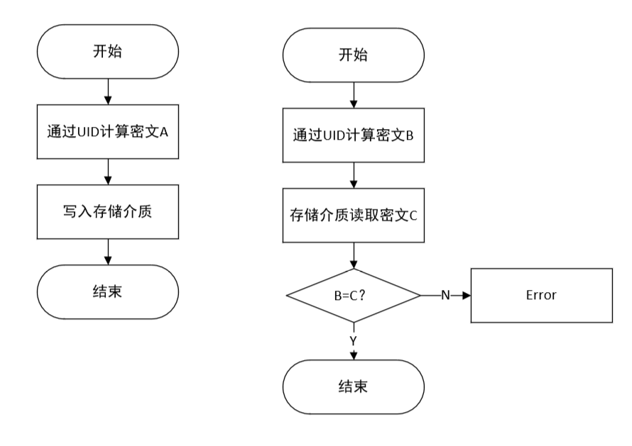

# Auth

- [1. UID认证](#1-uid认证)
- [2. eFuse/OTP](#2-efuseotp)
- [3. 加密算法](#3-加密算法)
  - [3.1. Hash](#31-hash)
  - [3.2. AES](#32-aes)
  - [3.3. 加盐(salt)](#33-加盐salt)
- [4. G2L加密](#4-g2l加密)
  - [4.1. 加盐](#41-加盐)
  - [4.2. sha256](#42-sha256)
  - [4.3. AES](#43-aes)
  - [4.4. 烧写](#44-烧写)
- [5. 从抄板角度看](#5-从抄板角度看)

## 1. UID认证

UID（Unique ID）唯一ID，芯片的身份认证，UID认证的目的是为了知识产权保护，防止非法复制，从实施流程来看分两部分

- 出厂前写入密文信息
  - 读取芯片的UID，通过一系列算法对UID加密得到密文A，保存在某存储介质中
- 程序启动前的认证
  - 读取芯片的UID，通过相同的算法对UID加密得到密文B，读取某存储介质，得到密文C，对比B和C

  

## 2. eFuse/OTP

- eFuse(electronic Fuse)，电子熔丝，只能被写入1次，写入之后不可修改。
- OTP（One Time Programmable memory），一次性编程

一般情况下芯片对eFuse空间分块，有一个寄存器控制eFuse区块的读写权限，因此，向eFuse中写入数据之后，再写入相应写保护位，即可保证数据不会被修改

## 3. 加密算法

### 3.1. Hash

Hash（哈希、散列），是一种从任何一种数据中创建小的数字“指纹”的方法。散列函数把消息或数据压缩成**摘要**，使得数据量变小，将数据的格式固定下来。

简单来说就是任意长度的数据，通过哈希运算之后，得到一个固定长度的数据。这个过程是不可逆的。

散列函数有非常大的定义域，但是值域是有限的，因此肯定会存在某两个数据对应的hash值相同，即必然存在哈希碰撞。在密码学中，不一定要求数据完全无法被破解，只要保证破解的成本足够大即可。

目前常用的散列算法

| 算法名称    | 输出大小(bits) | 内部大小 | 区块大小 | 长度大小 | 字符尺寸 | 碰撞情形 |
| :---------- | :------------- | :------- | :------- | :------- | :------- | :------- |
| MD2         | 128            | 384      | 128      | No       | 8        | 大多数   |
| MD4         | 128            | 128      | 512      | 64       | 32       | 是       |
| MD5         | 128            | 128      | 512      | 64       | 32       | 是       |
| SHA-0       | 160            | 160      | 512      | 64       | 32       | 是       |
| SHA-1       | 160            | 160      | 512      | 64       | 32       | 有缺陷   |
| SHA-256/224 | 256/224        | 256      | 512      | 64       | 32       | 否       |
| SHA-512/384 | 512/384        | 512      | 1024     | 128      | 64       | 否       |

MD5算法的破解，差分攻击，这种方法概括起来说是这样的：给定一个1024位的原文M1，加上一个特定的常数得到的新的明文M2。M1和M2的MD5码是一样的

- [Collisions for Hash Functions MD4, MD5, HAVAL-128 and RIPEMD. Xiaoyun Wang,Dengguo Feng,Xuejia Lai,et al. Rump Session of Crypto’04 E-print . 2004](https://eprint.iacr.org/2004/199.pdf)

### 3.2. AES

高级加密标准(Advanced Encryption Standard，缩写AES)，又称Rijndael加密法。

严格地说，AES和Rijndael加密法并不完全一样（虽然在实际应用中两者可以互换），因为Rijndael加密法可以支持更大范围的区块和密钥长度：AES的区块长度固定为128比特，密钥长度则可以是128，192或256比特；而Rijndael使用的密钥和区块长度均可以是128，192或256比特。加密过程中使用的密钥是由[Rijndael密钥生成方案](https://zh.wikipedia.org/wiki/Rijndael%E5%AF%86%E9%92%A5%E7%94%9F%E6%88%90%E6%96%B9%E6%A1%88)产生。

对称加密的一个特点就是，加密密钥和解密密钥相同，AES加密的密文可以通过密钥和解密算法得到明文。


- [密码学基础：AES加密算法](https://bbs.pediy.com/thread-253884.htm)
- [对称加密算法 - 廖雪峰](https://www.liaoxuefeng.com/wiki/1252599548343744/1304227762667553)

### 3.3. 加盐(salt)

盐（Salt），在密码学中，是指在散列之前将散列内容的任意固定位置插入特定的字符串。这个在散列中加入字符串的方式称为“加盐”。其作用是让加盐后的散列结果和没有加盐的结果不相同，在不同的应用情景中，这个处理可以增加额外的安全性。

比如，对于明文A`chipid`

明文A经过sha256散列，得到密文A`f503394b1380c6099e8c1b1f1e7acd971a49398eec7a0f827d747ad8353b7b78`

`chipid`是很容易读到的内容，如果直接把密文A存到存储介质中，作为认证信息，很容易被猜到破解

对明文A`chipid`加盐`123456`，得到加盐后的明文B`chipid123456`

明文B经过sha256散列，得到密文B`ec1029d97540c3102f92f0c5658fcf9907a22a5979fe23308f7ef972ea465658`

相对来说，加盐之后能更好防止被破解

## 4. G2L加密

对密文信息的认证放在BL2阶段，BL2不开源。

### 4.1. 加盐

```c
typedef union {
    struct {
        uint8_t chipid[8];
        char salt[8];
        char chipid_HEX_ASCII[16];
    }st;
    uint8_t raw[32];
}data;
```

- `chipid`为芯片的UID，共8字节
- `slat`为固定的字符串，
- `chipid_HEX_ASCII`为chipid的hex表示的ascii
  - 一个字节用2位16进制数表示
  - 高位补0

### 4.2. sha256

加盐后的`明文A`共32字节，通过sha256算法计算摘要，得到32字节`密文A`

### 4.3. AES

`密文A`作为AES的密钥，同时把`密文A`作为AES的密文，进行解密计算，得到`明文B`

这里虽然从AES算法流程看最后的计算结果是明文，但是从实际上整个Auth过程看是密文，因为这个明文B和明文A并不相同


### 4.4. 烧写

目前G2L不支持OTP，将数据存放到核心板的一片eeprom。eeprom内部存储默认值为`0xff`，直接存放的话，`明文B`在里面会很扎眼。

1. 全片写入随机数，随机数是生成的伪随机数列，以`明文B`的一段为`seed`

    ```c
    static long holdrand;
    void auth_set_seed(unsigned int seed)
    {
    holdrand = (long)seed;
    }
    int auth_random(void)
    {
    return(((holdrand = holdrand * 214013L + 2531011L) >> 16) & 0x7fff);
    }
    ```

2. 将`明文B`写入eeprom的某个特定位置，比如0x10;

## 5. 从抄板角度看

芯片通电后执行片内ROM，之后根据boot拨码启动，对于G2L来说，执行`spiflash`中的Uboot的BL2部分代码。

目前可以得到的信息

- BL2的二进制文件
- eeprom的全片内容
- 芯片的chipid
- 除BL2部分之外的全部源码，包括uboot和kernel

如果抄了一个板，即使把eeprom中的内容全部复制到新板，那chipID肯定是不同的，所以计算出来的密文肯定和eeprom中的不同，也不能通过认证，相当于eeprom和CPU绑定了。

想要绕过认证，只能通过分析BL2部分代码，所以好像只要没有B2L部分的代码，那就没有办法复制。
