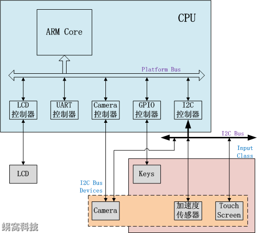
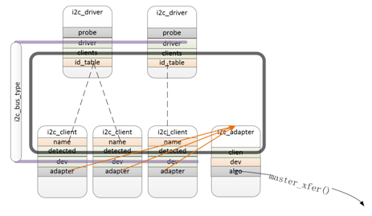

# Linux设备模型

- [1. 前言](#1-前言)
  - [1.1. 核心思想](#11-核心思想)
- [2. 相关数据结构](#2-相关数据结构)
- [3. 驱动开发基本步骤](#3-驱动开发基本步骤)
- [4. probe](#4-probe)
- [5. platform驱动模型](#5-platform驱动模型)
- [6. i2c驱动模型](#6-i2c驱动模型)
  - [6.1. 数据结构](#61-数据结构)
    - [6.1.1. bus](#611-bus)
    - [6.1.2. driver](#612-driver)
    - [6.1.3. device](#613-device)
  - [6.2. 注册流程](#62-注册流程)
    - [6.2.1. bus注册](#621-bus注册)
    - [6.2.2. i2c_driver向内核注册](#622-i2c_driver向内核注册)
    - [6.2.3. 构建i2c_client](#623-构建i2c_client)

## 1. 前言

Linux设备模型（Driver Model）主要包含Bus、Class、Device、Device_driver四个概念，设备模型将硬件设备归纳、分类，然后抽象出一套标准的数据结构和接口。驱动的开发，就简化为对内核所规定的数据结构的填充和实现。

硬件拓扑结构示例



硬件拓扑中可以看到Bus、Class、Device三个部分

<http://www.wowotech.net/device_model/13.html>

- `Bus` Linux认为总线是CPU和设备之间通信的通道，在设备模型中，所有的设备都需要连接到总线上，之后才能和cpu通信。
  - 但是对于芯片内一些外设而言是直接和cpu通信的，比如cpu可以直接寻址到uart控制器，因此抽象了一个`platform bus`将这些设备挂上去
- `Class` 面向对象程序设计思想中的类，将具有相似功能或属性的设备抽象，这样就可以抽象出一套可以在多个设备之间共用的数据结构和接口函数。因而从属于相同Class的设备的驱动程序，就不再需要重复定义这些公共资源，直接从Class中继承即可。
- `Device` 抽象系统中所有的硬件设备，描述它的名字、属性、从属的Bus、从属的Class等信息。
- `Device_driver` Linux设备模型用Driver抽象硬件设备的驱动程序，它包含设备初始化、电源管理相关的接口实现。而Linux内核中的驱动开发，基本都围绕该抽象进行（实现所规定的接口函数）。

### 1.1. 核心思想

- bus把device和driver联系起来，device解决“有什么东西可用”的问题，driver解决“怎么用这个东西”的问题，这样驱动开发就变成了填空题
- `Device`和`Device_driver`匹配上之后，就会执行`Device_driver`中的初始化函数（`probe`），设备被初始化，之后就可供consumer使用
  - 对于热插拔设备而言，`Device_driver`一直运行在内核中等待设备。没有设备插入的时候，没有`Device`结构体信息，因此`Driver`也就不会执行，当设备插入，内核会创建`Device`结构体，此时就会触发`Driver`执行
- 通过`Bus--->Device`的树状结构解决设备直接的依赖，要启动某个设备，会检查它依赖的总线和设备，先启动依赖项在启动设备
  - 在设备驱动中明确设备的依赖关系，之后内核能自动处理启动顺序
- 通过`Class`抽象共性

## 2. 相关数据结构

`struct device`是内核中描述设备的结构体，一般来说会针对具体的设备再新建一个结构体，而`struct device`作为其一成员变量。

```c
/**
 * struct device - The basic device structure
 * @parent:  The device's "parent" device, the device to which it is attached.
 *     In most cases, a parent device is some sort of bus or host
 *     controller. If parent is NULL, the device, is a top-level device,
 *     which is not usually what you want.
 * @p:    Holds the private data of the driver core portions of the device.
 *     See the comment of the struct device_private for detail.
 * @kobj:  A top-level, abstract class from which other classes are derived.
 * @init_name:  Initial name of the device.
 * @type:  The type of device.
 *     This identifies the device type and carries type-specific
 *     information.
 * @mutex:  Mutex to synchronize calls to its driver.
 * @bus:  Type of bus device is on.
 * @driver:  Which driver has allocated this
 * @platform_data: Platform data specific to the device.
 *     Example: For devices on custom boards, as typical of embedded
 *     and SOC based hardware, Linux often uses platform_data to point
 *     to board-specific structures describing devices and how they
 *     are wired.  That can include what ports are available, chip
 *     variants, which GPIO pins act in what additional roles, and so
 *     on.  This shrinks the "Board Support Packages" (BSPs) and
 *     minimizes board-specific #ifdefs in drivers.
 * @driver_data: Private pointer for driver specific info.
 * @links:  Links to suppliers and consumers of this device.
 * @power:  For device power management.
 *    See Documentation/driver-api/pm/devices.rst for details.
 * @pm_domain:  Provide callbacks that are executed during system suspend,
 *     hibernation, system resume and during runtime PM transitions
 *     along with subsystem-level and driver-level callbacks.
 * @pins:  For device pin management.
 *    See Documentation/driver-api/pinctl.rst for details.
 * @msi_list:  Hosts MSI descriptors
 * @msi_domain: The generic MSI domain this device is using.
 * @numa_node:  NUMA node this device is close to.
 * @dma_ops:    DMA mapping operations for this device.
 * @dma_mask:  Dma mask (if dma'ble device).
 * @coherent_dma_mask: Like dma_mask, but for alloc_coherent mapping as not all
 *     hardware supports 64-bit addresses for consistent allocations
 *     such descriptors.
 * @bus_dma_mask: Mask of an upstream bridge or bus which imposes a smaller DMA
 *    limit than the device itself supports.
 * @dma_pfn_offset: offset of DMA memory range relatively of RAM
 * @dma_parms:  A low level driver may set these to teach IOMMU code about
 *     segment limitations.
 * @dma_pools:  Dma pools (if dma'ble device).
 * @dma_mem:  Internal for coherent mem override.
 * @cma_area:  Contiguous memory area for dma allocations
 * @archdata:  For arch-specific additions.
 * @of_node:  Associated device tree node.
 * @fwnode:  Associated device node supplied by platform firmware.
 * @devt:  For creating the sysfs "dev".
 * @id:    device instance
 * @devres_lock: Spinlock to protect the resource of the device.
 * @devres_head: The resources list of the device.
 * @knode_class: The node used to add the device to the class list.
 * @class:  The class of the device.
 * @groups:  Optional attribute groups.
 * @release:  Callback to free the device after all references have
 *     gone away. This should be set by the allocator of the
 *     device (i.e. the bus driver that discovered the device).
 * @iommu_group: IOMMU group the device belongs to.
 * @iommu_fwspec: IOMMU-specific properties supplied by firmware.
 *
 * @offline_disabled: If set, the device is permanently online.
 * @offline:  Set after successful invocation of bus type's .offline().
 * @of_node_reused: Set if the device-tree node is shared with an ancestor
 *              device.
 *
 * At the lowest level, every device in a Linux system is represented by an
 * instance of struct device. The device structure contains the information
 * that the device model core needs to model the system. Most subsystems,
 * however, track additional information about the devices they host. As a
 * result, it is rare for devices to be represented by bare device structures;
 * instead, that structure, like kobject structures, is usually embedded within
 * a higher-level representation of the device.
 */
struct device {
  struct device    *parent;   //父设备，一般是bus或者controller

  struct device_private  *p;  //设备的私有信息

  struct kobject kobj;
  const char    *init_name; /* initial name of the device */
  const struct device_type *type;

  struct mutex    mutex;  /* mutex to synchronize calls to
           * its driver.
           */

  struct bus_type  *bus;    /* type of bus device is on */
  struct device_driver *driver;  /* which driver has allocated this
             device */
  void    *platform_data;  /* Platform specific data, device
             core doesn't touch it */
  void    *driver_data;  /* Driver data, set and get with
             dev_set/get_drvdata */
  struct dev_links_info  links;
  struct dev_pm_info  power;    //电源管理相关
  struct dev_pm_domain  *pm_domain;

#ifdef CONFIG_GENERIC_MSI_IRQ_DOMAIN
  struct irq_domain  *msi_domain;
#endif
#ifdef CONFIG_PINCTRL
  struct dev_pin_info  *pins;
#endif
#ifdef CONFIG_GENERIC_MSI_IRQ
  struct list_head  msi_list;
#endif

#ifdef CONFIG_NUMA
  int    numa_node;  /* NUMA node this device is close to */
#endif
  const struct dma_map_ops *dma_ops;
  u64    *dma_mask;  /* dma mask (if dma'able device) */
  u64    coherent_dma_mask;/* Like dma_mask, but for
               alloc_coherent mappings as
               not all hardware supports
               64 bit addresses for consistent
               allocations such descriptors. */
  u64    bus_dma_mask;  /* upstream dma_mask constraint */
  unsigned long  dma_pfn_offset;

  struct device_dma_parameters *dma_parms;

  struct list_head  dma_pools;  /* dma pools (if dma'ble) */

  struct dma_coherent_mem  *dma_mem; /* internal for coherent mem
               override */
#ifdef CONFIG_DMA_CMA
  struct cma *cma_area;    /* contiguous memory area for dma
             allocations */
#endif
  /* arch specific additions */
  struct dev_archdata  archdata;

  struct device_node  *of_node; /* associated device tree node */
  struct fwnode_handle  *fwnode; /* firmware device node */

  dev_t      devt;  /* dev_t, creates the sysfs "dev" */
  u32      id;  /* device instance */

  spinlock_t    devres_lock;
  struct list_head  devres_head;

  struct klist_node  knode_class;
  struct class    *class;
  const struct attribute_group **groups;  /* optional groups */

  void  (*release)(struct device *dev);
  struct iommu_group  *iommu_group;
  struct iommu_fwspec  *iommu_fwspec;

  bool      offline_disabled:1;
  bool      offline:1;
  bool      of_node_reused:1;
};
```

`struct device_driver`是内核中描述设备驱动的结构体，`include/linux/device.h`

```c
/**
 * struct device_driver - The basic device driver structure
 * @name:  Name of the device driver.
 * @bus:  The bus which the device of this driver belongs to.
 * @owner:  The module owner.
 * @mod_name:  Used for built-in modules.
 * @suppress_bind_attrs: Disables bind/unbind via sysfs.
 * @probe_type:  Type of the probe (synchronous or asynchronous) to use.
 * @of_match_table: The open firmware table.
 * @acpi_match_table: The ACPI match table.
 * @probe:  Called to query the existence of a specific device,
 *    whether this driver can work with it, and bind the driver
 *    to a specific device.
 * @remove:  Called when the device is removed from the system to
 *    unbind a device from this driver.
 * @shutdown:  Called at shut-down time to quiesce the device.
 * @suspend:  Called to put the device to sleep mode. Usually to a
 *    low power state.
 * @resume:  Called to bring a device from sleep mode.
 * @groups:  Default attributes that get created by the driver core
 *    automatically.
 * @pm:    Power management operations of the device which matched
 *    this driver.
 * @coredump:  Called when sysfs entry is written to. The device driver
 *    is expected to call the dev_coredump API resulting in a
 *    uevent.
 * @p:    Driver core's private data, no one other than the driver
 *    core can touch this.
 *
 * The device driver-model tracks all of the drivers known to the system.
 * The main reason for this tracking is to enable the driver core to match
 * up drivers with new devices. Once drivers are known objects within the
 * system, however, a number of other things become possible. Device drivers
 * can export information and configuration variables that are independent
 * of any specific device.
 */
struct device_driver {
  const char    *name;
  struct bus_type    *bus;

  struct module    *owner;
  const char    *mod_name;  /* used for built-in modules */

  bool suppress_bind_attrs;  /* disables bind/unbind via sysfs */
  enum probe_type probe_type;

  const struct of_device_id  *of_match_table;
  const struct acpi_device_id  *acpi_match_table;

  int (*probe) (struct device *dev);    //检测到设备执行
  int (*remove) (struct device *dev);   //设备移除时执行
  void (*shutdown) (struct device *dev);
  int (*suspend) (struct device *dev, pm_message_t state);
  int (*resume) (struct device *dev);
  const struct attribute_group **groups;

  const struct dev_pm_ops *pm;
  void (*coredump) (struct device *dev);

  struct driver_private *p;
};
```

## 3. 驱动开发基本步骤

在设备驱动模型框架下，设备驱动开发主要分两步

- 分配一个`struct device`类型的变量，填充必要的信息后，把它注册到内核中。
- 分配一个`struct device_driver`类型的变量，填充必要的信息后，把它注册到内核中。

这两步完成后，内核会在合适的时机，调用`struct device_driver`变量中的`probe`、`remove`、`suspend`、`resume`等回调函数，从而触发或者终结设备驱动的执行。而所有的驱动程序逻辑，都会由这些回调函数实现，此时，驱动开发者眼中便不再有“设备模型”，转而只关心驱动本身的实现。

- 一般情况下，`struct device`和`struct device_driver`都会被再包装一次或几次，针对具体设备进行相应封装处理。
- 内核提供一些对`struct device`操作的api，主要在`drivers/base/core.c`
  - 如`device_initialize`初始化，`device_register`注册到内核，`device_create`分配存储空间+初始化+注册到内核。
- `device`和`device_driver`必须具备相同的名称，内核才能完成匹配操作，进而调用`device_driver`中的相应接口。这里的同名，作用范围是同一个`bus`下的所有`device`和`device_driver`
  - ???????? dts中的`compatible`属性和这里提到的相同名字是什么关系
- `device`和`device_driver`需要挂在同一个`bus`下
- driver开发者可以在`struct device`变量中，保存描述设备特征的信息，如寻址空间、依赖的GPIOs等，因为`device`指针会在执行`probe`等接口时传入，这时`driver`就可以根据这些信息，执行相应的逻辑操作了。

## 4. probe

设备的`probe`由`bus`完成；每个`bus`都有一个`drivers_autoprobe`变量，通过这个变量来控制`bus`的行为（是否需要自动probe）

- 将`struct device`类型的变量注册到内核中时自动触发（`device_register`，`device_add`，`device_create_vargs`，`device_create`）
- 将`struct device_driver`类型的变量注册到内核中时自动触发（`driver_register`）
- 手动查找同一`bus`下的所有`device_driver`，如果有和指定`device`同名的`driver`，执行probe操作（`device_attach`）
- 手动查找同一`bus`下的所有`device`，如果有和指定`driver`同名的`device`，执行probe操作（`driver_attach`）
- 自行调用driver的probe接口，并在该接口中将该driver绑定到某个device结构中，即设置dev->driver（`device_bind_driver`）

<!-- 关于probe，既然probe执行是由bus控制，compatible在dtb中，这里是不是可以认为
需要device和driver名字匹配，那为什么在probe函数中还会有关于dtb的解析？
dtb是描述device的文件，那不应该在probe执行之前就已经创建好device了么，
还是说dtb在加载的时候就已经根据dtb的结构创建好了骨架，只包含了name等属性？？那在probe函数中应该就是只需要在向之前创建好的device中追加信息即可，那为什么代码里写的是重新申请资源？ -->

## 5. platform驱动模型

## 6. i2c驱动模型

<https://www.eet-china.com/mp/a34101.html>

对于i2c驱动模型而言



- Bus是一个全局变量`struct bus_type i2c_bus_type`
- Driver是`struct i2c_driver`类型的变量
- Device是`struct i2c_client`，但一般会对`i2c_client`在封装一层
  - 比如`struct ov5645`的成员变量中有`struct i2c_client`

<!-- 同时，i2c驱动模型中的Bus同时也是一个platform设备，也有对应的platform driver（`drivers/i2c/busses/i2c-riic.c`）？？？好像不太对
这里的i2c_adapter就是platform？？？ -->

怎么理解<https://kernel.meizu.com/device-tree.html>的3.2.2 mt_i2c_driver

因为第1级子节点会被注册成platform device，例如i2c/spi控制器，那么对应也需要注册platform driver。以i2c控制器驱动为例：

- 控制器首先会创建对应platform driver，把adapter注册成i2c device；
  - 怎么理解`控制器创建`
  - 这里的 `i2c device`是什么数据类型？这里不应该是把adapter注册成
- 在adapter的probe过程中，会调用of_i2c_register_devices()函数遍历控制器下挂的i2c设备的DTS节点，并将其注册成i2c_client；

### 6.1. 数据结构

#### 6.1.1. bus

kernel通过`struct bus_type`结构体来维护bus `include/linux/device.h`

```c
/**
 * struct bus_type - The bus type of the device
 *
 * @name:  The name of the bus.
 * @dev_name:  Used for subsystems to enumerate devices like ("foo%u", dev->id).
 * @dev_root:  Default device to use as the parent.
 * @bus_groups:  Default attributes of the bus.
 * @dev_groups:  Default attributes of the devices on the bus.
 * @drv_groups: Default attributes of the device drivers on the bus.
 * @match:  Called, perhaps multiple times, whenever a new device or driver
 *    is added for this bus. It should return a positive value if the
 *    given device can be handled by the given driver and zero
 *    otherwise. It may also return error code if determining that
 *    the driver supports the device is not possible. In case of
 *    -EPROBE_DEFER it will queue the device for deferred probing.
 * @uevent:  Called when a device is added, removed, or a few other things
 *    that generate uevents to add the environment variables.
 * @probe:  Called when a new device or driver add to this bus, and callback
 *    the specific driver's probe to initial the matched device.
 * @remove:  Called when a device removed from this bus.
 * @shutdown:  Called at shut-down time to quiesce the device.
 *
 * @online:  Called to put the device back online (after offlining it).
 * @offline:  Called to put the device offline for hot-removal. May fail.
 *
 * @suspend:  Called when a device on this bus wants to go to sleep mode.
 * @resume:  Called to bring a device on this bus out of sleep mode.
 * @num_vf:  Called to find out how many virtual functions a device on this
 *    bus supports.
 * @dma_configure:  Called to setup DMA configuration on a device on
 *      this bus.
 * @pm:    Power management operations of this bus, callback the specific
 *    device driver's pm-ops.
 * @iommu_ops:  IOMMU specific operations for this bus, used to attach IOMMU
 *              driver implementations to a bus and allow the driver to do
 *              bus-specific setup
 * @p:    The private data of the driver core, only the driver core can
 *    touch this.
 * @lock_key:  Lock class key for use by the lock validator
 * @need_parent_lock:  When probing or removing a device on this bus, the
 *      device core should lock the device's parent.
 *
 * A bus is a channel between the processor and one or more devices. For the
 * purposes of the device model, all devices are connected via a bus, even if
 * it is an internal, virtual, "platform" bus. Buses can plug into each other.
 * A USB controller is usually a PCI device, for example. The device model
 * represents the actual connections between buses and the devices they control.
 * A bus is represented by the bus_type structure. It contains the name, the
 * default attributes, the bus' methods, PM operations, and the driver core's
 * private data.
 */
struct bus_type {
  const char    *name;
  const char    *dev_name;
  struct device    *dev_root;
  const struct attribute_group **bus_groups;
  const struct attribute_group **dev_groups;
  const struct attribute_group **drv_groups;

  int (*match)(struct device *dev, struct device_driver *drv);
  int (*uevent)(struct device *dev, struct kobj_uevent_env *env);
  int (*probe)(struct device *dev);
  int (*remove)(struct device *dev);
  void (*shutdown)(struct device *dev);

  int (*online)(struct device *dev);
  int (*offline)(struct device *dev);

  int (*suspend)(struct device *dev, pm_message_t state);
  int (*resume)(struct device *dev);

  int (*num_vf)(struct device *dev);

  int (*dma_configure)(struct device *dev);

  const struct dev_pm_ops *pm;

  const struct iommu_ops *iommu_ops;

  struct subsys_private *p;
  struct lock_class_key lock_key;

  bool need_parent_lock;
};
```

i2c_bus_type

```c
struct bus_type i2c_bus_type = {
  .name    = "i2c",
  .match    = i2c_device_match,     //判断传入的 device和driver是否匹配
  .probe    = i2c_device_probe,
  .remove    = i2c_device_remove,
  .shutdown  = i2c_device_shutdown,
};
EXPORT_SYMBOL_GPL(i2c_bus_type);
```

- probe，注册一个driver（struct i2c_driver）或者一个device（struct i2c_client）的时候，先通过match匹配，如果成功就调用driver中的probe函数
- remove，当卸载driver或者device时，会调用remove来释放相应资源

在`drivers/i2c/i2c-core-base.c`的`i2c_init()`中有`retval = bus_register(&i2c_bus_type);`，向内核注册i2c总线

kernel总线维护驱动链表、设备链表两个链表，`i2c_driver`中的`struct list_head clients;`和`i2c_client`中的`struct list_head detected;`是链表项（链表注意container_of宏）

#### 6.1.2. driver

```c
/**
 * struct i2c_driver - represent an I2C device driver
 * @class: What kind of i2c device we instantiate (for detect)
 * @probe: Callback for device binding - soon to be deprecated
 * @probe_new: New callback for device binding
 * @remove: Callback for device unbinding
 * @shutdown: Callback for device shutdown
 * @alert: Alert callback, for example for the SMBus alert protocol
 * @command: Callback for bus-wide signaling (optional)
 * @driver: Device driver model driver
 * @id_table: List of I2C devices supported by this driver
 * @detect: Callback for device detection
 * @address_list: The I2C addresses to probe (for detect)
 * @clients: List of detected clients we created (for i2c-core use only)
 * @disable_i2c_core_irq_mapping: Tell the i2c-core to not do irq-mapping
 *
 * The driver.owner field should be set to the module owner of this driver.
 * The driver.name field should be set to the name of this driver.
 *
 * For automatic device detection, both @detect and @address_list must
 * be defined. @class should also be set, otherwise only devices forced
 * with module parameters will be created. The detect function must
 * fill at least the name field of the i2c_board_info structure it is
 * handed upon successful detection, and possibly also the flags field.
 *
 * If @detect is missing, the driver will still work fine for enumerated
 * devices. Detected devices simply won't be supported. This is expected
 * for the many I2C/SMBus devices which can't be detected reliably, and
 * the ones which can always be enumerated in practice.
 *
 * The i2c_client structure which is handed to the @detect callback is
 * not a real i2c_client. It is initialized just enough so that you can
 * call i2c_smbus_read_byte_data and friends on it. Don't do anything
 * else with it. In particular, calling dev_dbg and friends on it is
 * not allowed.
 */
struct i2c_driver {
  unsigned int class;

  /* Standard driver model interfaces */
  int (*probe)(struct i2c_client *, const struct i2c_device_id *);
  int (*remove)(struct i2c_client *);

  /* New driver model interface to aid the seamless removal of the
   * current probe()'s, more commonly unused than used second parameter.
   */
  int (*probe_new)(struct i2c_client *);

  /* driver model interfaces that don't relate to enumeration  */
  void (*shutdown)(struct i2c_client *);

  /* Alert callback, for example for the SMBus alert protocol.
   * The format and meaning of the data value depends on the protocol.
   * For the SMBus alert protocol, there is a single bit of data passed
   * as the alert response's low bit ("event flag").
   * For the SMBus Host Notify protocol, the data corresponds to the
   * 16-bit payload data reported by the slave device acting as master.
   */
  void (*alert)(struct i2c_client *, enum i2c_alert_protocol protocol,
          unsigned int data);

  /* a ioctl like command that can be used to perform specific functions
   * with the device.
   */
  int (*command)(struct i2c_client *client, unsigned int cmd, void *arg);

  struct device_driver driver;
  const struct i2c_device_id *id_table;

  /* Device detection callback for automatic device creation */
  int (*detect)(struct i2c_client *, struct i2c_board_info *);
  const unsigned short *address_list;
  struct list_head clients;

  bool disable_i2c_core_irq_mapping;
};
```

#### 6.1.3. device

device_node 是从设备树中解析出来的，需要转换为device（如platfrom_device，i2c_client等）

```c
/**
 * struct i2c_client - represent an I2C slave device
 * @flags: I2C_CLIENT_TEN indicates the device uses a ten bit chip address;
 *  I2C_CLIENT_PEC indicates it uses SMBus Packet Error Checking
 * @addr: Address used on the I2C bus connected to the parent adapter.
 * @name: Indicates the type of the device, usually a chip name that's
 *  generic enough to hide second-sourcing and compatible revisions.
 * @adapter: manages the bus segment hosting this I2C device
 * @dev: Driver model device node for the slave.
 * @irq: indicates the IRQ generated by this device (if any)
 * @detected: member of an i2c_driver.clients list or i2c-core's
 *  userspace_devices list
 * @slave_cb: Callback when I2C slave mode of an adapter is used. The adapter
 *  calls it to pass on slave events to the slave driver.
 *
 * An i2c_client identifies a single device (i.e. chip) connected to an
 * i2c bus. The behaviour exposed to Linux is defined by the driver
 * managing the device.
 */
struct i2c_client {
  unsigned short flags;    /* div., see below    */
  unsigned short addr;    /* chip address - NOTE: 7bit  */
          /* addresses are stored in the  */
          /* _LOWER_ 7 bits    */
  char name[I2C_NAME_SIZE];
  struct i2c_adapter *adapter;  /* the adapter we sit on  */
  struct device dev;    /* the device structure    */
  int init_irq;      /* irq set at initialization  */
  int irq;      /* irq issued by device    */
  struct list_head detected;
#if IS_ENABLED(CONFIG_I2C_SLAVE)
  i2c_slave_cb_t slave_cb;  /* callback for slave mode  */
#endif
};
```

### 6.2. 注册流程

- 向内核注册完bus之后，只是有了一个总线，总线上没有任何设备，需要再向上面注册`i2c_adapter`和其他的`i2c_client`，
  - 其中`i2c_adapter`是主设备，`i2c_client`是从设备
  - 这个不准确？这里注册的 bustype不知道是什么东西
- 设备树中关于i2c节点的描述，内核会为其创建一个`platform device`在platform bus中，会根据`compatible`匹配到相应的驱动`drivers/i2c/busses/i2c-riic.c`
  - 在i2c的platform驱动（总线驱动？）的probe函数中，会创建`i2c_adapter`设备，并通过`ret = i2c_add_adapter(adap);`添加到i2c总线中。设备树中写了3个i2c节点，所以这里会执行3遍
    - 为什么这里不需要指定是把当前的i2c_adapter添加到哪个i2c总线中？还是说对于linux来说一个i2c_adapter就是一个总线？那i2c_add_adapter()，是把adapter添加到了哪里？
    - 如果，每一个i2c_adapter就代表一条i2c总线，linux中用i2c_adapter来区分不同i2c bus，所以上面的i2c_add_adapter()是向i2c子系统进行注册？
    - 那为什么需要通过`postcore_initcall(i2c_init);`这里面进行`bus_register`，很明显这里只执行了一次，所以对于kernel来说只是注册了一条bus？
  - `i2c_adapter`对应物理设备（芯片内的i2c控制器），结构体中有`struct list_head userspace_clients;`这个链表是所有接在这个adapter下的设备，即这个i2c总线上的所有`i2c_client`
- `static int i2c_register_adapter(struct i2c_adapter *adap)`
  - `res = device_register(&adap->dev);`
  - `of_i2c_register_devices(adap);`

现在两个文档对于 i2c_client的注册 有两个说法

- <https://blog.csdn.net/snowwupl/article/details/9014977> 说`i2c_scan_static_board_info()`是重点
- <https://www.eet-china.com/mp/a34101.html> 说是`of_i2c_register_devices(adap);`

#### 6.2.1. bus注册

- <https://zhuanlan.zhihu.com/p/363569568>
- <https://sites.google.com/site/myembededlife/Home/s3c2440/i2c-and-core_initcall>
- <https://blog.csdn.net/u010961173/article/details/90770615>

`drivers/i2c/i2c-core-base.c`是 i2c 子系统的核心，在这里向内核注册bus

- `postcore_initcall(i2c_init);`声明initcall
  - `static int __init i2c_init(void)`
    - `retval = bus_register(&i2c_bus_type);`

这个是最早执行的，在`start_kernel()`中根据initcall相关调用顺序执行的，
可能甚至是跟platform总线是一块注册的？

#### 6.2.2. i2c_driver向内核注册

- `module_i2c_driver(ov5645_i2c_driver);`
  - `return i2c_add_driver(&(ov5645_i2c_driver) );`
    - `i2c_register_driver(THIS_MODULE, driver)`
      - `res = driver_register(&driver->driver);`
        - `ret = bus_add_driver(drv);`
          - `error = driver_attach(drv);`
            - `return bus_for_each_dev(drv->bus, NULL, drv, __driver_attach);`
              - `error = fn(dev, data);` fn是函数指针，值为传入的形参`__driver_attach`
                - `ret = driver_match_device(drv, dev);`
                  - `return drv->bus->match ? drv->bus->match(dev, drv) : 1;` 调用的是i2c_bus_type->match,即`i2c_device_match()`
                - `driver_probe_device(drv, dev);`
                  - `ret = really_probe(dev, drv);`
                    - `ret = drv->probe(dev);`
          - `error = driver_create_file(drv, &driver_attr_uevent);`

`drivers/media/i2c/ov5645.c`中有

```c
static struct i2c_driver ov5645_i2c_driver = {
  .driver = {
    .of_match_table = of_match_ptr(ov5645_of_match),
    .name  = "ov5645",
  },
  .probe  = ov5645_probe,
  .remove = ov5645_remove,
  .id_table = ov5645_id,
};

module_i2c_driver(ov5645_i2c_driver); 

```

`module_i2c_driver`宏是`include/linux/i2c.h`提供的工具，展开之后如下

```c
static int __init ov5645_i2c_driver_init(void)
{
  return i2c_add_driver(&(ov5645_i2c_driver) ); 
}
module_init(ov5645_i2c_driver_init); 

static void __exit ov5645_i2c_driver_exit(void)
{ 
  i2c_del_driver(&(ov5645_i2c_driver) ); 
} 
module_exit(ov5645_i2c_driver_exit);
```

insmod和rmmod会用到module_init和module_exit

`i2c_add_driver`也是宏，最终调用的是`int i2c_register_driver(struct module *, struct i2c_driver *);`

<!-- i2c_register_driver函数中对比i2c_drive->driver->of_match_table->compatible和i2c_client->name -->

#### 6.2.3. 构建i2c_client

- 在有设备树的情况下，i2c_client的生成是要在控制器驱动adapter注册情况下从设备树中枚举出来的。
- i2c控制器有很多种，不同的厂家都会设计自己特有的i2c控制器，但是不论哪一个控制器，最终都会调用 `i2c_register_adapter()`注册控制器驱动。
  - `drivers/i2c/busses/i2c-riic.c`

调用栈

- `static int riic_i2c_probe(struct platform_device *pdev)`
  - `ret = i2c_add_adapter(adap);`
    - `return i2c_register_adapter(adapter);`
      - `of_i2c_register_devices(adap);`
        - 遍历子节点`client = of_i2c_register_device(adap, node);`
          - `ret = of_i2c_get_board_info(&adap->dev, node, &info);`
            - `if (of_modalias_node(node, info->type, sizeof(info->type)) < 0) {`通过compatibles获取name
            - `ret = of_property_read_u32(node, "reg", &addr);`获取reg，即i2c地址
          - `client = i2c_new_device(adap, &info);` 申请内存
            - `status = device_register(&client->dev);` 向内核中注册device
              - `return device_add(dev);`
                - `error = bus_add_device(dev);`
                - `bus_probe_device(dev);`
                  - `device_initial_probe(dev);`
                    - `__device_attach(dev, true);`
                      - `ret = bus_for_each_drv(dev->bus, NULL, &data, __device_attach_driver);`
                        - `error = fn(drv, data);` fn是传进的函数指针，`__device_attach_driver`
                          - `return driver_probe_device(drv, dev);`
                            - `ret = really_probe(dev, drv);`
                              - `ret = drv->probe(dev);`

在`i2c_register_adapter()`中会先遍历i2c的设备树节点，这里就会得到i2c控制器节点中的各种设备子节点，创建`create pre-declared device nodes`

所以在i2c adapter注册的时候就已经创建好device了，在i2c驱动模型中，

```c
static int i2c_register_adapter(struct i2c_adapter *adap)
{
  int res = -EINVAL;

  /* Can't register until after driver model init */
  if (WARN_ON(!is_registered)) {
    res = -EAGAIN;
    goto out_list;
  }

  /* Sanity checks */
  if (WARN(!adap->name[0], "i2c adapter has no name"))
    goto out_list;

  if (!adap->algo) {
    pr_err("adapter '%s': no algo supplied!\n", adap->name);
    goto out_list;
  }

  if (!adap->lock_ops)
    adap->lock_ops = &i2c_adapter_lock_ops;

  rt_mutex_init(&adap->bus_lock);
  rt_mutex_init(&adap->mux_lock);
  mutex_init(&adap->userspace_clients_lock);
  INIT_LIST_HEAD(&adap->userspace_clients);

  /* Set default timeout to 1 second if not already set */
  if (adap->timeout == 0)
    adap->timeout = HZ;

  /* register soft irqs for Host Notify */
  res = i2c_setup_host_notify_irq_domain(adap);
  if (res) {
    pr_err("adapter '%s': can't create Host Notify IRQs (%d)\n",
           adap->name, res);
    goto out_list;
  }

  dev_set_name(&adap->dev, "i2c-%d", adap->nr);
  adap->dev.bus = &i2c_bus_type;
  adap->dev.type = &i2c_adapter_type;
  res = device_register(&adap->dev);
  if (res) {
    pr_err("adapter '%s': can't register device (%d)\n", adap->name, res);
    goto out_list;
  }

  res = of_i2c_setup_smbus_alert(adap);
  if (res)
    goto out_reg;

  dev_dbg(&adap->dev, "adapter [%s] registered\n", adap->name);

  pm_runtime_no_callbacks(&adap->dev);
  pm_suspend_ignore_children(&adap->dev, true);
  pm_runtime_enable(&adap->dev);

#ifdef CONFIG_I2C_COMPAT
  res = class_compat_create_link(i2c_adapter_compat_class, &adap->dev,
               adap->dev.parent);
  if (res)
    dev_warn(&adap->dev,
       "Failed to create compatibility class link\n");
#endif

  i2c_init_recovery(adap);

  /* create pre-declared device nodes */
  of_i2c_register_devices(adap);    //这里遍历i2c所有子节点，并分别为`struct i2c_client*`申请内存空间，填充相关信息到i2c_client
  i2c_acpi_install_space_handler(adap);
  i2c_acpi_register_devices(adap);

  if (adap->nr < __i2c_first_dynamic_bus_num)
    i2c_scan_static_board_info(adap);

  /* Notify drivers */
  mutex_lock(&core_lock);
  bus_for_each_drv(&i2c_bus_type, NULL, adap, __process_new_adapter);
  mutex_unlock(&core_lock);

  return 0;

out_reg:
  init_completion(&adap->dev_released);
  device_unregister(&adap->dev);
  wait_for_completion(&adap->dev_released);
out_list:
  mutex_lock(&core_lock);
  idr_remove(&i2c_adapter_idr, adap->nr);
  mutex_unlock(&core_lock);
  return res;
}
```
