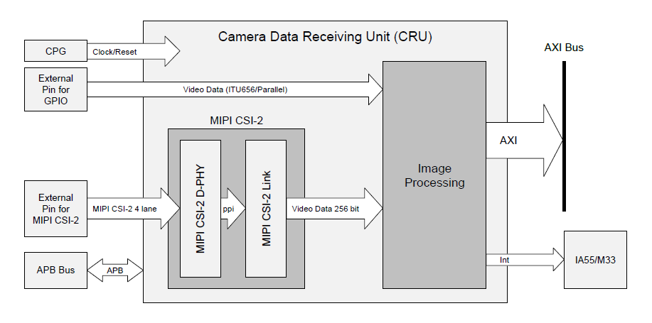

# RZG2L-Camera

- [1. 引言](#1-引言)
  - [1.1. 摄像头的数据传输流程如下](#11-摄像头的数据传输流程如下)
  - [1.2. g2l开启摄像头](#12-g2l开启摄像头)
- [2. 硬件外设](#2-硬件外设)
  - [2.1. csi](#21-csi)
  - [2.2. `35.2 Image Processing`](#22-352-image-processing)
  - [2.3. `36. Image Scaling Unit (ISU)`](#23-36-image-scaling-unit-isu)
- [3. v4l2 - media device](#3-v4l2---media-device)
  - [3.1. G2L](#31-g2l)
  - [3.2. 数据传输模型](#32-数据传输模型)
- [4. 驱动中关于cru的色彩空间转换](#4-驱动中关于cru的色彩空间转换)
- [5. `fltest_qt_camera`](#5-fltest_qt_camera)
  - [5.1. 设置cru最终输出的图像格式，对应`cru->output_is_yuv`](#51-设置cru最终输出的图像格式对应cru-output_is_yuv)
  - [5.2. 设置cru输入的数据格式，对应`cru->input_is_yuv`](#52-设置cru输入的数据格式对应cru-input_is_yuv)
- [6. gstreamer](#6-gstreamer)
  - [6.1. 测试](#61-测试)
    - [6.1.1. 最终输出源是waylandsink，输出RGB16能显示，输出RGB不能显示](#611-最终输出源是waylandsink输出rgb16能显示输出rgb不能显示)
    - [6.1.2. 最终的输出源是autovideosink时，输出RGB和RGB16都能正常显示](#612-最终的输出源是autovideosink时输出rgb和rgb16都能正常显示)
    - [6.1.3. 另外waylandsink支持NV12格式](#613-另外waylandsink支持nv12格式)
- [7. 结论](#7-结论)
- [参考](#参考)

## 1. 引言

- ov5645摄像头支持的输出模式，RAW RGB，RGB565/555/444，YUV422/420，YCbCr422
- rzg2l的cpu手册中，`35. Camera Data Receiving Unit (CRU)`包含两部分
  - `MIPI CSI-2`
    - 能从接收MIPI CSI格式的数据中分离video data部分，并送到`Image Processing`处理
  - `Image Processing`
    - 这部分能从`external Digital Parallel Interface`或者`MIPI CSI-2 block`接收数据，并执行相应的图形处理
      - 这里的`external Digital Parallel Interface`传输的数据是`ITU656/Parallel`
      - ITU-R Recommendation BT.656，有时候也称为ITU656，是一个简单的数字视频协议，用于将未压缩的PAL或NTSC（525行或者625行）信号进行编码。
        - <https://zh.m.wikipedia.org/zh-hans/BT.656>
      - rzg2l的摄像头，能从`mipi csi`读入；也能从`external Digital Parallel Interface`读入，即并口摄像头
    - The image-processed data is temporarily stored in the FIFO and transferred to an external memory.

### 1.1. 摄像头的数据传输流程如下

- ov5645部分
  - sensor读入数据，经过adc处理
  - image sensor processor处理
    - auto white balence, gamma, color space
  - image output interface，经过FIFO，通过mipi发送出去
- CRU的`MIPI CSI-2`部分
  - 从MIPI CSI接口读到的数据包中分离出video data部分
- CRU的`Image Processing`部分
  - 将从`MIPI CSI-2`输入的数据放到内部FIFO中，
  - 进行颜色空间转换等图像处理
  - 将输出通过`AXI bus`传输到外部内存
- 用户空间通过共享内存读取摄像头数据

### 1.2. g2l开启摄像头

- 通过qt程序，`fltest_qt_camera`
  - 疯狂掉帧，fps大概0.3吧，延迟巨大，大概4s
  - 从摄像头读取的数据是yuv422格式的，经过软件转换为rgb格式再显示
- 命令行方式，`gst-launch-1.0 v4l2src device=/dev/video0 io-mode=2 ! waylandsink window-x=0 window-y=0 window-width=1024 window-height=600`
  - 画面流畅
  - 在gstreamer框架下直接显示画面，摄像头数据是yuv422，直接输出到waylandsink，也是yuv422格式。
    - 但是一般LCD屏幕只能接收RGB数据，猜测这部分转换是在waylandsink中实现的，或者屏幕上有yuv转RGB的芯片？

这两种方式都没有使用到`Image Processing`硬件，什么功能都没用。`ICnMC`寄存器控制各个功能

## 2. 硬件外设

Figure 35.1 Block Diagram of CRU



### 2.1. csi

mipi csi，可以有4个lane，每个lane对应两根信号线（差分信号）。有一对差分时钟信号。ov5645，使用了2个lane，也就是，用两对差分信号传输数据，MDP0,MDN0,MDP1,MDN1

- [MIPI简介(三)——CSI-2](https://blog.csdn.net/baidu_38797690/article/details/125299661)

### 2.2. `35.2 Image Processing`

The image processing module is a data conversion module equipped with pixel color space conversion, LUT, pixel format conversion, etc

所以对于摄像头的色彩空间转换是由这部分的硬件完成的。

### 2.3. `36. Image Scaling Unit (ISU)`

- The ISU is a module that reads out the image stored in the external DRAM, scale down image size, and outputs the reduced image into the DRAM.
- ISU also support a color format conversion and cropping image.
- 对应设备树中`isum@10840000`，但是根据`compatible`没有找到相应的驱动源码，这部分的驱动好像是没有？
  - `cat /lib/modules/$(uname -r)/modules.builtin` 查看编译进内核的驱动
  - `cat /proc/modules` 查看已经加载的驱动，同`lsmod`

好像ISU的驱动根本就没有？

这里的ISU是独立于CRU的另一个外设，和CRU无关，只是根据手册中描述也有色彩空间转换功能。

## 3. v4l2 - media device

media framework，提供实时的 pipeline 管理，pipeline 就理解为管道，想象一下水管，里面的水就是数据流，输入设备中的 csi->isp->video 就组成了一个 pipeline 线路。media framework 提供 pipeline 的开启、关停、效果控制、节点控制等功能。

media framework 其中一个目的是：在运行时状态下发现设备拓扑并对其进行配置。为了达到这个目的，media framework将
硬件设备抽象为一个个的entity，它们之间通过links连接。

- entity：硬件设备模块抽象（类比电路板上面的各个元器件、芯片）
- pad：硬件设备端口抽象（类比元器件、芯片上面的管脚）
- link：硬件设备的连线抽象，link的两端是pad（类比元器件管脚之间的连线）

```text
#------------#                #------------#
|          __|__            __|__          |
|         |  |  |   link   |  |  |         |
|         | pad |<-------->| pad |         |
|         |__|__|          |__|__|         |
|            |                |            |
|   entity   |                |   entity   |
#------------#                #------------# 
```

可以想象一下，如果各个 entity 之间需要建立连接的话，就需要在 pad 中存储 link 以及 entity 信息，link 中需要存储 pad 与 entity 信息，entity 里面需要存储 link 与 pad 信息，属于你中有我，我中有你的情况。

在v4l2框架下，需要注册一个`v4l2_device`，和若干个`v4l2_subdev`。所有设备都抽象为`entity`，这样就可以在media框架下通过`/dev/media0`进行控制了

- [V4L2框架-media device](https://www.jianshu.com/p/83dcdc679901)

### 3.1. G2L

- rzg2l手册中描述`35. Camera Data Receiving Unit (CRU)`包含两部分，`35.1 MIPI CSI-2`和`35.2 Image Processing`，而在实际代码中的名字有点出入。
  - 设备树中的`cru: video@10830000`就是手册中的`35.2 Image Processing`，以下cru特指`35.2 Image Processing`，而非`35. Camera Data Receiving Unit (CRU)`
  - 设备树中的`csi2: csi2@10830400`就是手册中的`35.1 MIPI CSI-2`

设备注册流程如下

- G2L的`csi2: csi2@10830400`会注册一个`v4l2_subdev`设备
  - 这个subdev主要功能是`static int rzg2l_csi2_s_stream(struct v4l2_subdev *sd, int enable)`控制视频流数据的开启与否
  - 在`drivers/media/platform/rzg2l-cru/rzg2l-csi2.c`的`static int rzg2l_csi2_probe(struct platform_device *pdev)`函数中
    - `v4l2_subdev_init(&priv->subdev, &rzg2l_csi2_subdev_ops);`
    - `priv->subdev.entity.function = MEDIA_ENT_F_PROC_VIDEO_PIXEL_FORMATTER;` 像素格式化功能，也就是在这进行yuv和rgb转换？
    - `ret = v4l2_async_register_subdev(&priv->subdev);`，异步注册subdev设备
      - 这个并没有直接注册，而是把当前这个subdev加入到`sd->async_list`链表中，之后再异步注册
- ov5645在i2c的 probe中也会注册一个`v4l2_subdev`设备
  - 在`drivers/media/i2c/ov5645.c`的`static int ov5645_probe(struct i2c_client *client, const struct i2c_device_id *id)`函数中
    - `v4l2_i2c_subdev_init(&ov5645->sd, client, &ov5645_subdev_ops);`
    - `ov5645->sd.entity.function = MEDIA_ENT_F_CAM_SENSOR;` 传感器，也就是最原始的数据来源。这里设置的是uyvy格式
    - `ret = v4l2_async_register_subdev(&ov5645->sd);`异步注册
- G2L的`cru: video@10830000`会注册一个`v4l2_device`设备
  - 在`drivers/media/platform/rzg2l-cru/rzg2l-core.c`的`static int rzg2l_cru_probe(struct platform_device *pdev)`
    - `ret = rzg2l_cru_dma_register(cru, irq);`注册dma，以及CRU相关配置
      - `ret = v4l2_device_register(cru->dev, &cru->v4l2_dev);` 注册`v4l2_device`设备
        - `v4l2_device`设备作为顶层管理者，管理众多`v4l2_subdev`
    - `ret = rzg2l_cru_mc_init(cru);`
      - `ret = media_device_register(&group->mdev);`注册media设备，向用户空间暴露`/dev/media0`接口
    - `ret = rzg2l_cru_parallel_init(cru);`
      - `ret = v4l2_async_notifier_register(&cru->v4l2_dev, &cru->notifier);`
        - 遍历链表，挨个注册之前添加到链表中的子设备。（`drivers/media/v4l2-core/v4l2-async.c`）

至此，一个`v4l2_device`设备，两个`v4l2_subdev`设备注册完。所有的`v4l2_subdev`都暴露一个`/dev/v4l-subdev`节点给用户空间；在cru注册时向用户空间暴露了一个`/dev/media0`节点

上述流程简要说是，csi，ov5645分别异步注册v4l2_subdev；cru在probe的时候，创建了`/dev/media0`节点，同时，扫描了v4l2框架下的`v4l2_subdev`，并进行了注册；同时，创建link，连接cru和csi

最后这个创建link连接cru和csi，是在v4l2框架中，所有设备都被抽象化为entity，这些entity之间通过link连接。而在G2L的CPU手册中，摄像头数据通过外部接口传入cpu之后，首先要通过csi处理，过滤出数据部分，之后交给cru进行图像处理。这个数据传输路径是在设计芯片的时候就确定了，所以csi连接cru是必经之路，所以直接在驱动中就创建了link，而不需要用户通过命令行再创建link。

通过加入entities链表的方式（每个设备都抽象为entity，加入），media_device保持了对所有的设备信息的查询和控制的能力，而该能力会通过media controller框架在用户空间创建meida设备节点，将这种能力暴露给用户进行控制。

通过`media-ctl -d /dev/media0 -p`可以查看所有的 media 框架下的设备信息，能看到之前注册的两个v4l2_subdev和一个v4l2_device

### 3.2. 数据传输模型

- [V4L2视频采集的基本流程](https://www.cnblogs.com/unreal/articles/1820295.html)
- [Linux V4L2子系统-videobuf2框架分析（三）](https://blog.csdn.net/u011037593/article/details/115681069)

## 4. 驱动中关于cru的色彩空间转换

在`drivers/media/platform/rzg2l-cru/rzg2l-dma.c`中

- 根据`if (cru->output_is_yuv == cru->input_is_yuv)`判断是否开CRU的启色彩空间转换功能，两个bool
  - `output_is_yuv`是根据`switch (cru->format.pixelformat) {` 判断的
    - 在qt中是调用`if (-1 == ioctl(fd, VIDIOC_S_FMT, &fmt)) {`这个ioctl时设置的
    - 对应在`rzg2l-dma.c`中是`case V4L2_PIX_FMT_BGR24:`
      - 另外，根据CPU手册`Table 35.13 Image Output Formats (2/2)`输出格式为RGB888时，其实输出的格式对应为`BGR`，低字节为B，高字节为R
    - 所以`output_is_yuv`值为0
  - `input_is_yuv`是根据`switch (cru->mbus_code) {` 判断的
    - 在驱动中是`case MEDIA_BUS_FMT_UYVY8_2X8:`
    - 所以`input_is_yuv`值为1
  - `output_is_yuv`和`input_is_yuv`不相等，所以会使用硬件，在这里会设置`ICnDMR`寄存器的控制字
- `rzg2l_cru_write(cru, ICnDMR, icndmr);` 设置输出的格式，最终设置寄存器值
  - ICnDMR是寄存器地址偏移量
  - icndmr是控制字

## 5. `fltest_qt_camera`

- `int VideoCapture::Init(int iscru)`创建link，连接摄像头和csi
- `int VideoCapture::LoopCapture()` 从v4l2框架中获取内核空间中的摄像头数据，并显示
  - `if (-1 == ioctl(fd, VIDIOC_DQBUF, &buf)) {` 把数据放回缓存队列（相当于在用户空间释放内存，将这个空闲内存给到内核空间）
  - `convert_yuv_to_rgb_buffer((unsigned char *)buffers[buf.index].start[0],rgb, this->width, this->height);` yuv422转rgb888，消耗算力
  - 在label中显示图像
    - `QImage *mage = new QImage(rgb, width, height, QImage::Format_RGB888);`
    - `QImage resultimg = mage->scaled(img->size());`将图像缩放到label控件的尺寸
    - `img->setPixmap(QPixmap::fromImage(resultimg));`

在`videocapture.h`中`#define BUFINFOR_NUM  (6)`可以设置队列的大小。

### 5.1. 设置cru最终输出的图像格式，对应`cru->output_is_yuv`

在`int VideoCapture::Init(int iscru)`中有设置输出的像素格式的ioctl，将输出格式改为`BGR24`，如下

```cpp
fd = ::open(devname, O_RDWR | O_NONBLOCK, 0);
if (fd < 0) {
  qDebug() << "Open " << devname << "dev fail " <<strerror(errno);
  ::exit(1);
}
qDebug() << "devname:" << devname << "Video fd: " << fd;
'ov5645 0-003c':0 [fmt:UYVY8_2X8/1280x960 field:none]
struct v4l2_format fmt;
CLEAR(fmt);

fmt.type = V4L2_BUF_TYPE_VIDEO_CAPTURE;
fmt.fmt.pix.width = this->width;
fmt.fmt.pix.height = this->height;
// fmt.fmt.pix.pixelformat = V4L2_PIX_FMT_YUYV;  //设置图像格式
fmt.fmt.pix.pixelformat = V4L2_PIX_FMT_BGR24;  //设置图像格式
'ov5645 0-003c':0 [fmt:UYVY8_2X8/1280x960 field:none]
if (-1 == ioctl(fd, VIDIOC_S_FMT, &fmt)) {
  qDebug() << "VIDIOC_S_FMT" << strerror(errno);
  ::exit(1);
}
```

### 5.2. 设置cru输入的数据格式，对应`cru->input_is_yuv`

cru的数据是从摄像头中获取的，经由csi处理获取到数据部分，创建link连接csi和cru

对应命令行开启摄像头中的`media-ctl -d /dev/media0 -l "'rzg2l_csi2 10830400.csi2':1 -> 'CRU output':0 [1]"`

在`int VideoCapture::Init(int iscru)`函数中

```c
ret = media_parse_setup_links(media, "'rzg2l_csi2 10830400.csi2':1 -> 'CRU output':0 [1]");
if (ret) {
  qDebug() << "Unable to set link";
  if (media)
    media_device_unref(media);
  ::exit(1);
}
```

在fltest_qt_camera中的下拉菜单选择的摄像头数据格式，格式为`format UYVY2X8 640x480`，在`drivers/media/i2c/ov5645.c`中会对摄像头数据格式进行匹配
ov5645的驱动中预设了几种数据格式，根据传入的参数匹配到一个最相似的格式。这里匹配到的是`'ov5645 0-003c':0 [fmt:UYVY8_2X8/1280x960 field:none]`

对应命令行开启摄像头中的`media-ctl -d /dev/media0 -V "'ov5645 0-003c':0 [fmt:UYVY8_2X8/1280x960 field:none]"`

在`int VideoCapture::Init(int iscru)`函数中

```c
char formatstr[128];
snprintf(formatstr, 128, "'ov5645 0-003c':0 [fmt:UYVY2X8/%dx%d]", this->width, this->height);
ret = v4l2_subdev_parse_setup_formats(media, formatstr);
if (ret) {
  qDebug() << "Unable to setup formats";
  if (media)
    media_device_unref(media);
  return videocapture_errno_setformat;
}
```

## 6. gstreamer

手册中测试方法

```text
media-ctl -d /dev/media0 -l "'rzg2l_csi2 10830400.csi2':1 -> 'CRU output':0 [1]"
media-ctl -d /dev/media0 -V "'ov5645 0-003c':0 [fmt:UYVY8_2X8/1280x960 field:none]"

gst-launch-1.0 v4l2src device=/dev/video0 io-mode=2 ! waylandsink window-x=0 window-y=0 window-width=1024 window-height=600
```

- 当使用qt界面的程序的时候，qt程序cpu占用50%多
- 使用gst，最终输出是`waylandsink`，占用27%

当占用到50%，就会卡。基本可以判断waylandsink中使用到了硬件解码

### 6.1. 测试

videotestsrc源能生成测试视频

通过`gst-inspect-1.0 waylandsink`查询，waylansink支持RGB格式，但是

```text
gst-launch-1.0 videotestsrc ! video/x-raw,format=RGB16,width=1280,height=960 ! waylandsink window-x=0 window-y=0 window-width=1024 window-height=600
  生成RGB565格式视频，输出到waylandsink，能正常显示
gst-launch-1.0 videotestsrc ! video/x-raw,format=RGB,width=1280,height=960 ! waylandsink window-x=0 window-y=0 window-width=1024 window-height=600
  生成RGB格式视频，不能显示

gst-launch-1.0 videotestsrc ! video/x-raw,format=RGB16,width=1024,height=600 ! autovideosink
gst-launch-1.0 videotestsrc ! video/x-raw,format=RGB,width=1024,height=600 ! autovideosink
  这两个都能正常显示
```

#### 6.1.1. 最终输出源是waylandsink，输出RGB16能显示，输出RGB不能显示

```text
root@okg2l /home/root$ gst-launch-1.0 videotestsrc ! video/x-raw,format=RGB16,width=1280,height=960 ! waylandsink window-x=0 window-y=0 window-width=1024 window-height=600
Setting pipeline to PAUSED ...
Pipeline is PREROLLING ...
Pipeline is PREROLLED ...
Setting pipeline to PLAYING ...
New clock: GstSystemClock
^Chandling interrupt.
Interrupt: Stopping pipeline ...
Execution ended after 0:00:01.313004251
Setting pipeline to NULL ...
Freeing pipeline ...

root@okg2l /home/root$ gst-launch-1.0 videotestsrc ! video/x-raw,format=RGB,width=1280,height=960 ! waylandsink window-x=0 window-y=0 window-width=1024 window-height=600
Setting pipeline to PAUSED ...
Pipeline is PREROLLING ...
ERROR: from element /GstPipeline:pipeline0/GstVideoTestSrc:videotestsrc0: Internal data stream error.
Additional debug info:
../gstreamer-1.16.3/libs/gst/base/gstbasesrc.c(3072): gst_base_src_loop (): /GstPipeline:pipeline0/GstVideoTestSrc:videotestsrc0:
streaming stopped, reason not-negotiated (-4)
ERROR: pipeline doesn't want to preroll.
Setting pipeline to NULL ...
Freeing pipeline ...
```

#### 6.1.2. 最终的输出源是autovideosink时，输出RGB和RGB16都能正常显示

```text
root@okg2l /home/root$ gst-launch-1.0 videotestsrc ! video/x-raw,format=RGB16,width=1024,height=600 ! autovideosink
Setting pipeline to PAUSED ...
Pipeline is PREROLLING ...
Got context from element 'autovideosink0': gst.gl.GLDisplay=context, gst.gl.GLDisplay=(GstGLDisplay)"\(GstGLDisplayWayland\)\ gldisplaywayland0";
Pipeline is PREROLLED ...
Setting pipeline to PLAYING ...
New clock: GstSystemClock
^Chandling interrupt.
Interrupt: Stopping pipeline ...
Execution ended after 0:00:02.640105584
Setting pipeline to NULL ...
Freeing pipeline ...

root@okg2l /home/root$ gst-launch-1.0 videotestsrc ! video/x-raw,format=RGB,width=1024,height=600 ! autovideosink
Setting pipeline to PAUSED ...
Pipeline is PREROLLING ...
Got context from element 'autovideosink0': gst.gl.GLDisplay=context, gst.gl.GLDisplay=(GstGLDisplay)"\(GstGLDisplayWayland\)\ gldisplaywayland0";
Pipeline is PREROLLED ...
Setting pipeline to PLAYING ...
New clock: GstSystemClock
^Chandling interrupt.
Interrupt: Stopping pipeline ...
Execution ended after 0:00:02.082643126
Setting pipeline to NULL ...
Freeing pipeline ...
```

当最后的输出节点设置为 autovideosink 会有输出 `Got context from element 'autovideosink0': gst.gl.GLDisplay=context, gst.gl.GLDisplay=(GstGLDisplay)"\(GstGLDisplayWayland\)\ gldisplaywayland0";`可以看到，最终选择的是OpenGL绘制的窗口，最终使用的输出节点是 `glimagesink`，把最后的 `autovideosink`替换成`glimagesink`也可

这里又涉及到了OpenGL

- <https://gstreamer.freedesktop.org/documentation/gl-wayland/gstgldisplay_wayland.html?gi-language=c>
- <https://gstreamer.freedesktop.org/documentation/gl/gstglcontext.html?gi-language=c>

#### 6.1.3. 另外waylandsink支持NV12格式

```text
gst-launch-1.0 videotestsrc ! video/x-raw,format=NV12 ! waylandsink window-x=0 window-y=0 window-width=1024 window-height=600
  成像质量差一点，但是能正常显示
```

所以，手册中命令行方式直接把摄像头图像输出到waylandsink，可能根本就没进行色彩空间转换？但是LCD屏幕只能接收RGB格式数据，那具体是在哪里转换的？可能问题的关键就在waylandsink吧

- [常用图像像素格式 NV12、NV21、I420、YV12、YUYV](https://blog.csdn.net/weixin_42581177/article/details/126718981)

## 7. 结论

- 瑞萨的驱动中包含cru进行色彩空间转换的相关功能，只要输出cru和输出cru的图像格式不一致，会自动开启cru相关转换功能
- 瑞萨手册中描述cru输出RGB，实际输出的格式是BGR，而目前QT版本不支持BGR格式的图片显示，所以需要在QT程序中进行红蓝转换，再显示
  - 目前采用的测试方法，摄像头仍输出yuv422格式数据，经过cru进行图像转换到bgr888格式，再在qt里把r和b反转，再显示
- 对于qt程序中画面撕裂卡顿，全是因为CPU处理图像速度不够，对qt程序中频繁申请内存空间等代码优化之后，能稍微减缓一点
  - 但是为什么通过`top`查看CPU占用只有50%多，而不是70%，80%甚至更多？
    - 可能受制于IO速度？
  - 那为什么使用waylandsink显示摄像头画面不卡？
    - 可能在软件层面没有进行色彩空间转换？LCD屏幕上有色彩空间转换相关的芯片？
  - 根据autovideosink的输出信息，猜测可能用到了OpenGL
    - 当把摄像头数据直接输出到autovideosink，画面也会卡顿，qt中也会卡顿，所以猜测qt绘制窗口画面时也是用到了OpenGL
    - 是不是还会和gpu有关系？
- 对于摄像头的输出格式，在`OV5645_CSP3_DS_1.11.PDF`的第3页有描述，虽然手册中`6.4 format description`中描述了很多种格式，但是好像不是都支持
  - 可以在`drivers/media/i2c/ov5645.c`文件开头的数组种修改摄像头的寄存器配置信息，但是尝试失败了
- 另外关于`36. Image Scaling Unit (ISU)`，根据手册描述，也有色彩空间转换功能，但是没有找到相关驱动，也就没有再深究

## 参考

- [深入浅出，快速弄明白 gst-launch-1.0 PIPELINE-DESCRIPTION 管道描述语法](https://www.361shipin.com/blog/1533080182879944704)
- [深入学习Linux摄像头（二）v4l2驱动框架](https://blog.csdn.net/weixin_42462202/article/details/99680969)
- [select函数及fd_set介绍](https://www.cnblogs.com/wuyepeng/p/9745573.html)
- [camera_kernel之---media子系统（3）](https://blog.csdn.net/weixin_43503508/article/details/107883286)
- [V4L2框架解析](https://deepinout.com/v4l2-tutorials/linux-v4l2-architecture.html)
- [Linux V4L2之camera](https://qingsong.blog.csdn.net/article/details/119763522)
- [Linux v4l2架构学习](https://blog.csdn.net/ldl617/article/details/115063305)

- END
