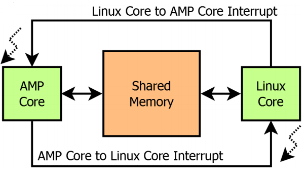
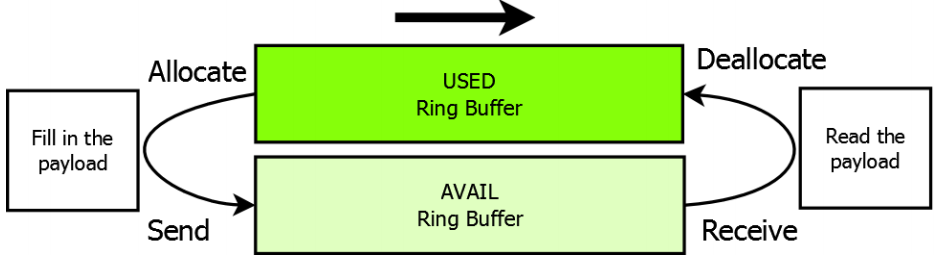
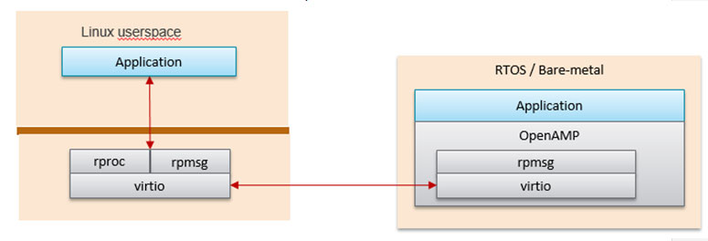
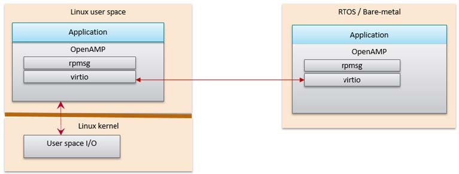
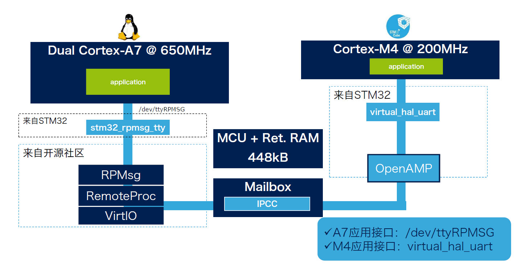
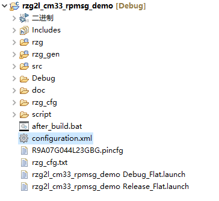
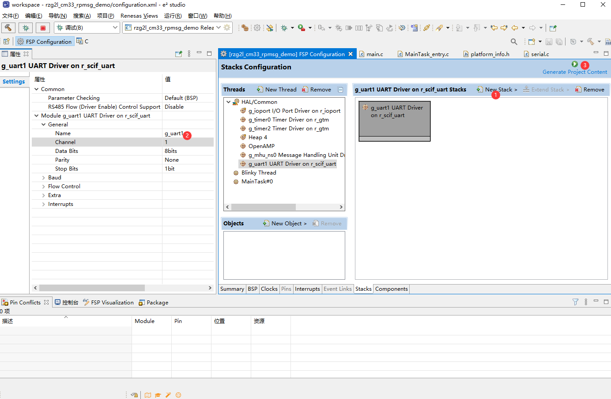
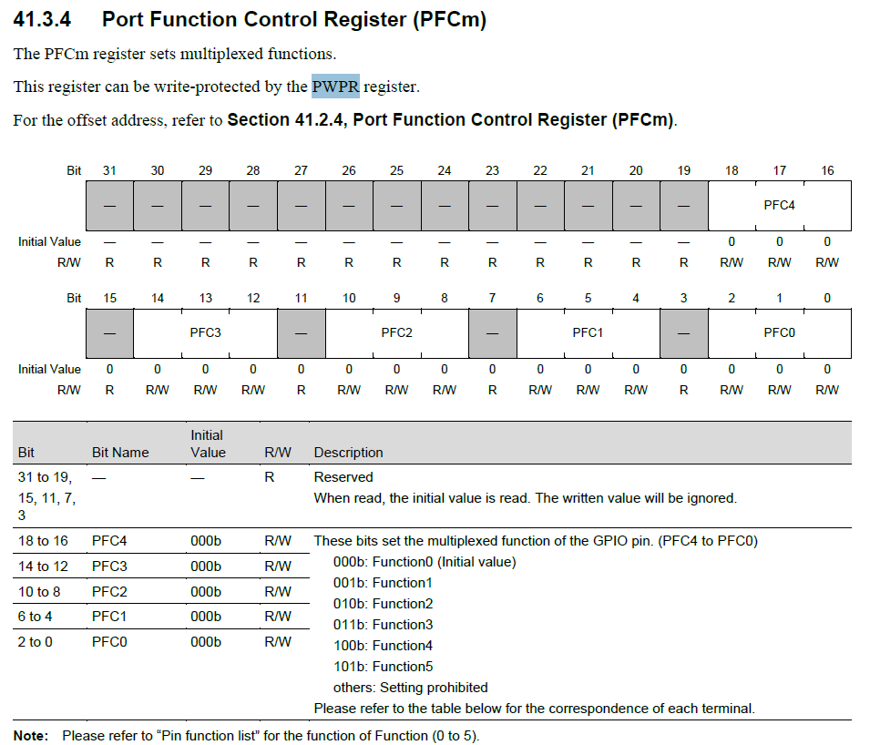

# RZG2L Inter-processor communication

- [1. 异构多核通信](#1-异构多核通信)
  - [1.1. 数据传递](#11-数据传递)
  - [1.2. Remoteproc](#12-remoteproc)
  - [1.3. RPMsg](#13-rpmsg)
  - [1.4. OpenAMP](#14-openamp)
    - [1.4.1. OpenAMP的应用场景](#141-openamp的应用场景)
- [2. RZG2L方案整体架构](#2-rzg2l方案整体架构)
- [3. A55核](#3-a55核)
  - [3.1. 初始化](#31-初始化)
  - [3.2. 创建remoteproc](#32-创建remoteproc)
    - [3.2.1. 对remoteproc初始化](#321-对remoteproc初始化)
    - [3.2.2. 处理资源表](#322-处理资源表)
  - [3.3. 创建RPMsg device](#33-创建rpmsg-device)
    - [3.3.1. 创建virtio设备](#331-创建virtio设备)
    - [3.3.2. 处理`vr_info->shm.io`](#332-处理vr_info-shmio)
    - [3.3.3. 初始化rpmsg_vdev](#333-初始化rpmsg_vdev)
  - [3.4. app](#34-app)
    - [3.4.1. 构造payload](#341-构造payload)
    - [3.4.2. 创建endpoint](#342-创建endpoint)
    - [3.4.3. poll](#343-poll)
- [4. CM33核](#4-cm33核)
  - [4.1. 构建项目](#41-构建项目)
    - [4.1.1. 项目结构](#411-项目结构)
    - [4.1.2. 配置功能](#412-配置功能)
  - [4.2. 关于SCIF](#42-关于scif)
    - [4.2.1. GPIO](#421-gpio)
    - [4.2.2. SCIF](#422-scif)
    - [4.2.3. 关于printf](#423-关于printf)
  - [4.3. 关于链接](#43-关于链接)
    - [烧录](#烧录)
- [参考](#参考)

## 1. 异构多核通信

多核CPU运行模式主要有以下三种：

- 非对称多处理（Asymmetric multiprocessing，AMP）每个CPU内核运行一个独立的操作系统或同一操作系统的独立实例（instantiation）
- 对称多处理（Symmetric multiprocessing，SMP）一个操作系统的实例可以同时管理所有CPU内核，且应用并不绑定某一个内核
- 混合多处理（Bound multiprocessing，BMP）一个操作系统的实例可以同时管理所有CPU内核，但每个应用被锁定于某个指定的核心

RZG2L有两个Cortex-A55@1.2GHz，一个Cortex-M33@200MH，分别运行Linux和Freertos，是AMP系统

### 1.1. 数据传递

- 划分一块内存，这块内存M33核和A55核都能够访问，作为共享内存，用来传输数据
- 使用中断来保证同步，通知对方存取数据



内存的管理由主核负责，在每个通信方向上都有两个缓冲区，分别是USED和AVAIL，这个缓冲区可以按照RPMsg中消息的格式分成一块一块链接形成一个环



### 1.2. Remoteproc

Remoteproc主要功能就是对远程处理器的生命周期进行管理，即启动、停止远程处理器。例如A55核先启动之后，可以使用Remoteproc远程加载固件、远程启动M33核

### 1.3. RPMsg

RPMsg是实现对远程处理器信息传递，基于VirtIO的消息总线，它允许内核驱动程序与系统上可用的远程处理器进行通信，同时，驱动程序可以根据需要公开适当的用户空间接口。一般来说会把对外接口封装成TTY设备。

### 1.4. OpenAMP

OpenAMP包含两部分，`libmetal`和`open_amp`

- `libmetal`
- `open_amp`
  - `virtio`
    - 是network和disk device的虚拟化标准，用来管理共享内存
  - `rpmsg`
  - `remoteproc`

OpenAMP是Mentor Graphics与赛灵思公司为了使在AMP系统的设计中开发出的RTOS和裸机程序能够与开源Linux社区提供的接口进行互通讯，而共同通过的一个标准化的嵌入式多核框架。提供远程处理器生命周期管理、非对称多核通信等，主要是给RTOS或者裸机系统提供服务。也可以用于Linux用户空间中。

OpenAMP使用libmetal作为抽象层来访问设备、处理中断、共享内存。

#### 1.4.1. OpenAMP的应用场景

##### 1.4.1.1. RPMsg Implementation in Kernel Space

Linux kernel space provides RPMsg and Remoteproc, but the RPU application requires Linux to load it in order to talk to the RPMsg counterpart in the Linux kernel. This is the Linux kernel RPMsg and Remoteproc implementation limitation.



##### 1.4.1.2. OpenAMP RPMsg Implementation in Linux Userspace

OpenAMP library can also be used in Linux userspace. In this configuration, the remote processor can run independently to the Linux host processor.



## 2. RZG2L方案整体架构

对于stm32mp157，他的M核使用了OpenAMP框架来提供remoteproc和rpmsg功能，在Linux端则是直接使用Liunx内核提供的相关功能



但是RZG2L的Linux端，没有使用Linux内核中的remoteproc和rpmsg，而是使用OpenAMP库实现Remoteproc，RPMsg，而且关于Remoteproc，没有用到远程加载firmware、远程启动内核相关功能


- 最底层是UIO/VFIO，由Linux内核提供
- libmetal使用UIO/VFIO相关接口
- open-amp依赖于libmetal，提供Remoteproc、RPMsg相关功能
- 最顶层的是应用程序，使用RPMsg相关接口完成核间通信

在M33核中，使用到了

- Message Handling Unit (MHU)
  - 提供Inter-Processor Interrupt
- General Timer (GTM)
  - 用来Configures the tick for FreeRTOS.

## 3. A55核

在A55端程序，依赖`libmetal.so.0.1.0`和`libopen_amp.so.0.1.0`库，没有源码，只有库文件，在`/opt/poky/3.1.5/sysroots/aarch64-poky-linux/usr/lib64/`目录里。

### 3.1. 初始化

1. 初始化libmetal，`init_system();`
2. `metal_init(&metal_param);`

### 3.2. 创建remoteproc

`platform_create_proc()`

所谓创建remoteproc就是填充`struct remoteproc`结构体，这个结构体里有一个`void *priv;`私有数据

这里的私有数据是指`struct remoteproc_priv`，包含三部分

- `notify_id`，用来区分不同的remoteproc
- `mbx_chn_id`，未知用途，代码中没有用到
- `struct vring_info *vr_info`，这个结构体里是三个`struct shm_info`，描述了三块共享内存
  - `rsc`，对应设备树里`42f00000.rsctbl`，用来存放资源表
  - `ctl`，对应设备树里`43000000.vring-ctl0`，用途未知
  - `shm`，对应设备树里`43200000.vring-shm0`，用来传递数据

在OpenAMP的框架下编程，所以使用的是`metal_allocate_memory(sizeof(struct remoteproc));`为remoteproc指针申请内存

#### 3.2.1. 对remoteproc初始化

`remoteproc_init(rproc_inst, &rzg2_proc_ops, rproc_priv)`，传入操作（rzg2_proc_ops），函数指针。

最终调用的是`rzg2_proc_init()`

- 首先是打开设备`metal_device_open(ipi.bus_name, ipi.name, &dev);`
  - 类似linux中的操作模式，先open，再进行后续操作
  - open中主要是进行硬件配置、打开ipi设备，这里指的是`10400000.mbox-uio`
- `metal_device_io_region()`
  - 使用的都是metal库的api，把这个设备看作是一块内存，映射到用户空间
  - 返回的是一个`struct metal_io_region *`，是这块内存的物理地址、虚拟地址等相关信息
- `rzg2_enable_interrupt()`
  - 在这里设置中断相关的函数，处理核间通信时产生的中断信号，注册中断的回调函数等
- `init_memory_device()`
  - 把私有数据中的`vring_info`里面的内存填充上地址了，之前都是null
    - vring_info的三个shm_info本质都是内存块，在metal框架下认为其都是设备；在设备树中描述的，就是设备
  - 以其中`vring_info->rsc`为例
    - `ret = metal_device_open(info->bus_name, info->name, &dev);` 先打开设备`42f00000.rsctbl`
    - `info->io = metal_device_io_region(dev, 0x0U);` 这一步就是获取 内存区块，类似一个操作句柄？
    - `remoteproc_init_mem()`初始化这块内存
    - `remoteproc_add_mem()`，把这块内存添加到remoteproc结构体，也就是说，把这块内存交由remoteproc管理，

#### 3.2.2. 处理资源表

资源表是用来描述cm33都有哪些资源的，相当于cm33的自身属性，所以需要放到cm33的程序中，由CM33核的程序定义的，并存放在`42f00000.rsctbl`共享内存中

A55核想要使用cm33核，需要知道cm33有哪些功能，所以是在A55中读资源表。

需要先映射这段内存的物理地址到虚拟地址（MMU）

`rsc_table = remoteproc_mmap(rproc_inst, &pa, NULL, rsc_size, 0, NULL);`

之后`ret = remoteproc_set_rsc_table(rproc_inst, rsc_table, rsc_size);`，解析资源表，并把数据保存到remoteproc中，这样a55就知道cm33有哪些资源可用了

### 3.3. 创建RPMsg device

```c

/**
 * struct rpmsg_virtio_device - representation of a rpmsg device based on virtio
 * @rdev: rpmsg device, first property in the struct
 * @vdev: pointer to the virtio device
 * @rvq: pointer to receive virtqueue
 * @svq: pointer to send virtqueue
 * @shbuf_io: pointer to the shared buffer I/O region
 * @shpool: pointer to the shared buffers pool
 * @endpoints: list of endpoints.
 */
struct rpmsg_virtio_device {
  struct rpmsg_device rdev;
  struct virtio_device *vdev;
  struct virtqueue *rvq;
  struct virtqueue *svq;
  struct metal_io_region *shbuf_io;
  struct rpmsg_virtio_shm_pool *shpool;
};

struct  rpmsg_device *
platform_create_rpmsg_vdev(void *platform, unsigned int vdev_index,
               unsigned int role,
               void (*rst_cb)(struct virtio_device *vdev),
               rpmsg_ns_bind_cb ns_bind_cb);
```

`platform_create_rpmsg_vdev()；`的返回值是`struct rpmsg_device *`，这个相当于基类指针，但是后续真正使用的时候，需要把他直接强制类型转换到`struct rpmsg_virtio_device *`

在`rpmsg_virtio_device`结构体中，第一个成员变量就是`rpmsg_device`，所以他们的地址是相同的，所以可以直接强制类型转换。

#### 3.3.1. 创建virtio设备

```c
/* remoteproc_create_virtio
 *
 * create virtio device, it returns pointer to the created virtio device.
 *
 * @rproc: pointer to the remoteproc instance
 * @vdev_id: virtio device ID
 * @role: virtio device role
 * @rst_cb: virtio device reset callback
 *
 * return pointer to the created virtio device, NULL for failure.
 */
struct virtio_device *
remoteproc_create_virtio(struct remoteproc *rproc,
       int vdev_id, unsigned int role,
       void (*rst_cb)(struct virtio_device *vdev));
```

##### 3.3.1.1. 和G2L相悖的部分

RPMsg是基于virtio的messaging bus，允许本地处理器和远程处理器进行交流。它是用`virtio vring`在共享内存上发送和接收数据的。具体而言，`vring`是单向的，总共需要开两个实现双向传输，在两个处理器都能看到的内存空间上会开辟共享的buffer。使用IPI来通知处理器在共享内存中有待读取的数据。

```c
/*
* Channel direction and usage:
*
*  ========   <-- new msg ---=============--------<------   =======
* ||      ||                || CHANNEL 1 ||                ||     ||
* || A55  ||  ------->-------=============--- buf free-->  || M33 ||
* ||      ||                                               ||     ||
* ||master||  <-- buf free---=============--------<------  ||slave||
* ||      ||                || CHANNEL 2 ||                ||     ||
*  ========   ------->-------=============----new msg -->   =======
*/
```

A55是master（VIRTIO_DEV_MASTER），CM33是slave（VIRTIO_DEV_SLAVE），但是目前只看到了一个virtio设备，所以上述说法，只能进行单向通信，但是目前好像是能双向通信，

- 或者说，之前对程序理解有误，就是在进行单向通信？
- 或者是，再什么地方进行了另一个方向的virtio设备创建？
- 或者是，这里说的virtio设备和上述的channel不是对应的，这里的virtio能进行双向通信？

#### 3.3.2. 处理`vr_info->shm.io`

在创建remoteproc的时候已经对私有数据中的vr_info->shm.io这个region初始化了，所以他代表的就是`43200000.vring-shm0`这块内存。

```c
pa = metal_io_phys(prproc->vr_info->shm.io, 0x0U);  //根据这一个整个的内存块和offset，计算出想要使用的物理地址。
shbuf_io = remoteproc_get_io_with_pa(rproc, pa);  //根据物理地址，再转换到指向相应的内存struct metal_io_region *
```

这里经过转换是为了有些场景可能需要对这一大块内存region分块使用，所以需要根据offset确定真正用的region。但是这里是直接使用的一整块，offset为0，最后`prproc->vr_info->shm.io`和`shbuf_io`指向的内容是相同的。

```c
LPRINTF("initializing rpmsg shared buffer pool\n");
shbuf = metal_io_phys_to_virt(shbuf_io, pa);        //把物理地址转换到虚拟地址（MMU转换），在linux中对内存的访问都需要经过MMU映射
len = metal_io_region_size(prproc->vr_info->shm.io);
rpmsg_virtio_init_shm_pool(&shpool, shbuf, len);    //填充 shpool 结构体，包含内存起始地址、可用大小、总大小。
```

处理之后得到一个`struct rpmsg_virtio_shm_pool`共享内存池，之后的核间数据传输都需要通过shpool传输。

```c
/**
 * struct rpmsg_virtio_shm_pool - shared memory pool used for rpmsg buffers
 * @get_buffer: function to get buffer from the pool
 * @base: base address of the memory pool
 * @avail: available memory size
 * @size: total pool size
 */
struct rpmsg_virtio_shm_pool {
  void *base;
  size_t avail;
  size_t size;
};

struct rpmsg_virtio_shm_pool shpool;
```

#### 3.3.3. 初始化rpmsg_vdev

```c
rpmsg_init_vdev(rpmsg_vdev, vdev, ns_bind_cb, shbuf_io, &shpool); //初始化一个rpmsg virtio device设备
```

这里的`ns_bind_cb`是一个回调函数，负责根据`name server`创建`end point`，但是目前通过它创建的ept都不能正常通信。

### 3.4. app

在这里进行真正数据发送相关内容，在这之前已经完成了准备工作，建立了核间通信的前提。rpmsg通信是一个udp-like通信协议，到这相当于建立了两个设备之间的ip连接，接下需要根据不同app选择相应端口(endpoint)

#### 3.4.1. 构造payload

申请消息体需要的内存，这里直接根据`rpmsg_virtio_get_buffer_size()`申请空间。

```c
/**
 * rpmsg_virtio_get_buffer_size - get rpmsg virtio buffer size
 *
 * @rdev - pointer to the rpmsg device
 *
 * @return - next available buffer size for text, negative value for failure
 */
int rpmsg_virtio_get_buffer_size(struct rpmsg_device *rdev);
```

柔性数组

#### 3.4.2. 创建endpoint

```c
/* Create RPMsg endpoint */
if (svcno == 0) {
  svc_name = (char *)CFG_RPMSG_SVC_NAME0;
} else {
  svc_name = (char *)CFG_RPMSG_SVC_NAME1;
}
ret = rpmsg_create_ept(&rp_ept, rdev, svc_name, APP_EPT_ADDR,
                RPMSG_ADDR_ANY,
                rpmsg_service_cb0, rpmsg_service_unbind);
```

- `rp_ept`，创建的ept
- `rdev`，`struct rpmsg_device *`结构体指针，rpmsg设备
- `svc_name`端口的名字，通信双方两个端口名字应当一致
- `APP_EPT_ADDR`是本机的地址，即A55端地址。rpmsg通信需要双方都创建ept，目的地址源地址要互相对应。
- `RPMSG_ADDR_ANY`是对方地址，这里是`0xFFFFFFFF`
  - 当目的地址是`0xFFFFFFFF`时，会根据名字在channel内进行广播，查询对方的地址，类似arp
  - 当源地址是`0xFFFFFFFF`时，会自动根据端口使用情况选择一个没有占用的端口，类似dhcp
  - 这里说`地址`不准确，通信的时候，A55核和CM33核端程序地址都设置为0，也能正常通信，用端口比较好
    - rpmsg设备对应一条建立好的ip数据通道（相当于建立了路由关系）
    - src和dest对应 端口号
    - rpmsg设备加上src和dest，组合之后，类似socket
- `rpmsg_service_cb0`，接收到数据之后的回调函数
- `rpmsg_service_unbind0`，通信结束后的回调函数

#### 3.4.3. poll

```c
while (!is_rpmsg_ept_ready(&rp_ept)) //等待源地址和目的地址都自动获取成功
    platform_poll(priv);    //poll机制  //priv是之前创建的remoteproc结构体指针

LPRINTF("RPMSG service has created.\n");

for (i = 0, size = pi.min; i < (int)pi.num; i++, size++) {
  i_payload->num = i;
  i_payload->size = size;

  /* Mark the data buffer. */
  memset(&(i_payload->data[0]), 0xA5, size);

  LPRINTF("sending payload number %lu of size %lu\n",
        i_payload->num, (2 * sizeof(unsigned long)) + size);

  ret = rpmsg_send(&rp_ept, i_payload, (2 * sizeof(unsigned long)) + size); //发送

  if (ret < 0) {
    LPRINTF("Error sending data...%d\n", ret);
    break;
  }
  LPRINTF("echo test: sent : %lu\n", (2 * sizeof(unsigned long)) + size);

  expect_rnum++;
  do {
    platform_poll(priv);  //poll
  } while ((rnum < expect_rnum) && !err_cnt);
  usleep(10000);
}

LPRINTF("************************************\n");
LPRINTF(" Test Results: Error count = %d \n", err_cnt);
LPRINTF("************************************\n");
```

## 4. CM33核

### 4.1. 构建项目

CM33端程序运行在FreeRTOS之上的，使用了OpenAMP框架作为多核通信基础

运行两个task，分别是`blinky_thread_entry.c`和`MainTask_entry.c`，控制LED和通信

代码框架由e2stdio生成

#### 4.1.1. 项目结构

- `Debug/` 编译过程中生成的中间文件、最终的elf文件、分段之后的程序
- `rzg/`
  - `arm/` arm内核启动文件
  - `aws/` FreeRTOS相关文件
  - `board/` 板子相关，这部分不会根据`configuration.xml`配置文档自动变化
    - `rzg2l_smarc/board_leds.c` 核心板的LED
    - `rzg2l_smarc/pin_data.c` 引脚使用情况（SCIF）
  - `fsp/` 外设的驱动文件
  - `linaro/` libmetal、open-amp
- `rzg_cfg/` freertos等配置文件
- `rzg_gen/` 自动生成的代码框架，包含main.c
- `script/` 链接脚本
- `src/` 用户代码
- `configuration.xml`
- `after_build.bat`

#### 4.1.2. 配置功能

打开`configuration.xml`文件之后，选择`FSP Configuration`视图即可配置项目





如图，可在`New Stack`添加相应功能，在`属性`面板中可以修改相关属性，保存之后`Genetate Project Content`生成修改后的项目。

`rzg_gen/`目录下的文件都是自动生成的，最好不要直接修改里面的文件，否则下一次`Genetate Project Content`之后会覆盖之前的修改。

自动生成的文件第一行有相关注释

```c
/* generated main source file - do not edit */
```

### 4.2. 关于SCIF

对于FreeRTOS而言，不像linux驱动框架那样有丰富的子系统，配置外设资源需要考虑的相对来说比较底层。

对于SCIF外设，需要从几个方面配置相关功能

- SCIF对应的GPIO相关配置
- SCIF的时钟、复位
- SCIF功能的相关寄存器

#### 4.2.1. GPIO

GPIO的功能包括功能复用、电气属性、滤波等

```c
volatile uint8_t  * p_pmc;        //模式选择，GPIO or Peripheral
volatile uint32_t * p_iolh;       //驱动能力
volatile uint32_t * p_sr;         //设置压摆率
volatile uint32_t * p_pupd;       //上、下拉
volatile uint32_t * p_filonoff;   //数字噪声滤波
volatile uint32_t * p_filnum;     
volatile uint32_t * p_filclksel;
volatile uint32_t * p_pfc;        //复用功能选择
```

另外，Port Function Control Register (PFCm)寄存器有写保护



##### 4.2.1.1. 歧路

开发板上SCIF2转换成了RS485电平，SCIF1是TTL电平，瑞萨官方提供的`rzg2l_cm33_rpmsg_demo`中使用的是SCIF2

在`configuration.xml`中改成SCIF1之后，默认`rzg\board\rzg2l_smarc\pin_data.c`中设置的是SCIF2的引脚，没有自动修改，所以一直没有波形

```c
typedef struct
{

  ...

  union
  {
    __IOM uint16_t PM38;
    struct
    {
      __IOM uint8_t L;
      __IOM uint8_t H;
    } PM38_byte;
    struct
    {
      __IOM uint8_t PM38_0 : 2;
      __IOM uint8_t PM38_1 : 2;
      __IOM uint8_t PM38_2 : 2;
      uint8_t              : 2;
      uint8_t              : 8;
    } PM38_b;
  };

  ...

  union
  {
    __IOM uint8_t PMC38;
    struct
    {
      __IOM uint8_t PMC38 : 3;
      uint8_t             : 5;
    } PMC38_b;
  };

  ...

  union
  {
    __IOM uint32_t PFC38;
    struct
    {
      __IOM uint16_t L;
      __IOM uint16_t H;
    } PFC38_hword;
    struct
    {
      __IOM uint8_t LL;
      __IOM uint8_t LH;
      __IOM uint8_t HL;
      __IOM uint8_t HH;
    } PFC38_byte;
    struct
    {
      __IOM uint8_t PFC38_0 : 3;
      uint8_t               : 1;
      __IOM uint8_t PFC38_1 : 3;
      uint8_t               : 1;
      __IOM uint8_t PFC38_2 : 3;
      uint8_t               : 5;
      uint8_t               : 8;
      uint8_t               : 8;
    } PFC38_b;
  };

  ...

  __IM uint8_t RESERVED314[3];
  union
  {
    __IOM uint8_t PWPR;
    struct
    {
      uint8_t             : 6;
      __IOM uint8_t PFCWE : 1;
      __IOM uint8_t BOWI  : 1;
    } PWPR_b;
  };

  ...

} R_GPIO_Type;

#define R_GPIO_BASE    0x41030010

#define R_GPIO    ((R_GPIO_Type *) R_GPIO_BASE)


R_GPIO->PMC38_b.PMC38 = R_GPIO->PMC38_b.PMC38 | 0x3;    //P40_0 P40_1 Peripheral Function Mode    //offset: 0x0238

R_GPIO->PWPR_b.BOWI = 0;
while(R_GPIO->PWPR_b.BOWI != 0);
R_GPIO->PWPR_b.PFCWE = 1;   //PFC write en  //0x3014

R_GPIO->PFC38_b.PFC38_0 = 1;    //p40_0，复用功能1   // 0x04e0
R_GPIO->PFC38_b.PFC38_1 = 1;

R_GPIO->PM38_b.PM38_0 = 2;  //P40_0，TX，output   // 0x0170
R_GPIO->PM38_b.PM38_1 = 1;  //P40_1，RX，input

```

#### 4.2.2. SCIF

驱动文件在`rzg\fsp\src\r_scif_uart\r_scif_uart.c`，里面有操作SCIF相关寄存器的操作

对于项目中设置使用的SCIF1，相关定义在`rzg_gen\hal_data.c`中的`const uart_instance_t g_uart1`全局变量，设置了串口的属性、操作api等

`src\serial.c`中的代码属于应用代码，对SCIF的驱动再进行封装

```c
static void outbyte1(console_t console, char c)
{
  flag_tend = 0;
  g_uart1.p_api->write(g_uart1.p_ctrl, &c, 1);
  while(flag_tend == 0)
  {
    __WFI();
  }
}

void outbyte(console_t console, char c)
{
  if (!xSerialPortInitialized)
  {
    g_uart1.p_api->open(g_uart1.p_ctrl, g_uart1.p_cfg);
    g_uart1.p_api->callbackSet(g_uart1.p_ctrl, uart_callback, NULL, NULL);
    xSerialPortInitialized = 1;
  }

  /* Standard practice to convert \n to \r\n */
  if (c == '\n')
    outbyte1(console, '\r');

  outbyte1(console, c);
}
```

#### 4.2.3. 关于printf

瑞萨修改了`mbed Microcontroller Library`，通过`mbed_minimal_formatted_string`将数据格式化处理，调用`outbyte()`通过串口发送

```c
/*
 * Modified by Renesas so functions pass a context down to outbyte().
 * outbyte() is implemented elsewhere so that it can pass a context that our
 * serial output function. This is all done to allow us to create a printf_raw()
 * function that outputs immediately to the UART for emergency output such as an
 * abort.
 */

/**
 * @brief      Parse formatted string and invoke write handlers based on type.
 *
 * @param      buffer     The buffer to write to, write to stdout if NULL.
 * @param[in]  length     The length of the buffer.
 * @param[in]  format     The formatted string.
 * @param[in]  arguments  The va_list arguments.
 * @param[in]  console The method of char data control.
 *
 * @return     Number of characters written.
 */
int mbed_minimal_formatted_string(char *buffer, size_t length, const char *format, va_list arguments, console_t console)
```

### 4.3. 关于链接

链接脚本在`script\fsp.ld`

CM33核的程序编译完成之后是`rzg2l_cm33_rpmsg_demo.elf`，需要经过`after_build.bat`处理

```bat
arm-none-eabi-objcopy -O binary -j .secure_vector %1.elf %1_secure_vector.bin
arm-none-eabi-objcopy -O binary -j .non_secure_vector %1.elf %1_non_secure_vector.bin
arm-none-eabi-objcopy -O binary -j .secure_code %1.elf %1_secure_code.bin
arm-none-eabi-objcopy -O binary -j .non_secure_code -j .data %1.elf %1_non_secure_code.bin
```

#### 烧录

烧录的时候只用到了`secure_vector` `non_secure_vector` `secure_code` `non_secure_code`这四个section，CM33核的程序是在uboot阶段加载并启动cm33核

分别把四段程序加载到相应位置

| bin                                         |    addr    |
| :------------------------------------------ | :--------: |
| rzg2l_cm33_rpmsg_demo_non_secure_vector.bin | 0x00010000 |
| rzg2l_cm33_rpmsg_demo_secure_vector.bin     | 0x0001FF80 |
| rzg2l_cm33_rpmsg_demo_non_secure_code.bin   | 0x40010000 |
| rzg2l_cm33_rpmsg_demo_secure_code.bin       | 0x42EFF440 |

从内存卡中加载，uboot的shell中输入命令

```text
dcache off
mmc dev 1

fatload mmc 1:1 0x0001FF80 rzg2l_cm33_rpmsg_demo_secure_vector.bin
fatload mmc 1:1 0x42EFF440 rzg2l_cm33_rpmsg_demo_secure_code.bin
fatload mmc 1:1 0x00010000 rzg2l_cm33_rpmsg_demo_non_secure_vector.bin
fatload mmc 1:1 0x40010000 rzg2l_cm33_rpmsg_demo_non_secure_code.bin

cm33 start_debug 0x0001FF80 0x00010000
dcache on
```

从emmc中加载

```text
dcache off
ext4load mmc 0:1 0x0001FF80 boot/cm33/rzg2l_cm33_rpmsg_demo_secure_vector.bin
ext4load mmc 0:1 0x42EFF440 boot/cm33/rzg2l_cm33_rpmsg_demo_secure_code.bin
ext4load mmc 0:1 0x00010000 boot/cm33/rzg2l_cm33_rpmsg_demo_non_secure_vector.bin
ext4load mmc 0:1 0x40010000 boot/cm33/rzg2l_cm33_rpmsg_demo_non_secure_code.bin
cm33 start_debug 0x0001FF80 0x00010000
dcache on
```

设置环境变量，自动启动CM33内核，其中bin文件放在`/boot/cm33/`，从emmc中加载到指定地址，之后启动CM33

```text
setenv name4cm33 rzg2l_cm33_rpmsg_demo
setenv emmcloadcm33 'ext4load mmc 0:1 0x0001FF80 boot/cm33/${name4cm33}_secure_vector.bin;ext4load mmc 0:1 0x42EFF440 boot/cm33/${name4cm33}_secure_code.bin;ext4load mmc 0:1 0x00010000 boot/cm33/${name4cm33}_non_secure_vector.bin;ext4load mmc 0:1 0x40010000 boot/cm33/${name4cm33}_non_secure_code.bin;'
setenv startcm33 'dcache off;run emmcloadcm33;cm33 start_debug 0x0001FF80 0x00010000;dcache on;'
setenv bootcmd 'run startcm33;run bootcmd_check;run bootimage'

saveenv
```

## 参考

- [Introduction_to_OpenAMPlib_v1.1a](https://www.openampproject.org/docs/whitepapers/Introduction_to_OpenAMPlib_v1.1a.pdf)
- [STM32MP157的Remoteproc和RPMsg框架](https://hceng.cn/2020/05/09/STM32MP157%E2%80%94%E2%80%94Remoteproc%E5%92%8CRPMsg/)
- [STM32MP157A和IPCC](https://forsworns.github.io/zh/blogs/20210223/)
- [Linux UIO机制--用户空间I / O操作方法](https://blog.csdn.net/hpu11/article/details/109395820)
- [RPMsg in Linux and OpenAMP Project - Xilinx Wiki](https://xilinx-wiki.atlassian.net/wiki/spaces/A/pages/2423717889/RPMsg+in+Linux+and+OpenAMP+Project)
- [UG1186 - Libmetal and OpenAMP User Guide (v2022.1)](https://docs.xilinx.com/r/en-US/ug1186-zynq-openamp-gsg/Libmetal-and-OpenAMP-User-Guide)
- [OpenAMP remoteproc wiki](https://github.com/OpenAMP/open-amp/wiki/OpenAMP-remoteproc)
- [Rpmsg与Virtio介绍](https://blog.csdn.net/weixin_42813232/article/details/125577142)
- [RPMsg：协议简介](https://blog.csdn.net/ZM_Yang/article/details/107453233)
- [RZ/G2L and RZ/G2UL Group Multi-OS Package](https://www2.renesas.cn/cn/en/software-tool/rzg2l-and-rzg2ul-group-multi-os-package#overview)
- [objcopy 介绍](http://linux.51yip.com/search/objcopy)
