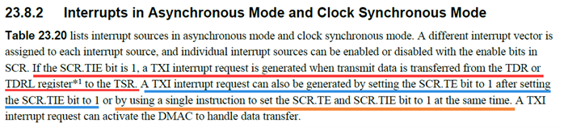

# RZG2L SCI(F)

- [1. 关于串口通信](#1-关于串口通信)
  - [1.1. SCIF](#11-scif)
  - [1.2. SCI](#12-sci)
- [2. 波特率](#2-波特率)
  - [2.1. BRR计算公式](#21-brr计算公式)
  - [2.2. 时钟树](#22-时钟树)
  - [2.3. 误差](#23-误差)
- [3. RZG2L SCIF3](#3-rzg2l-scif3)
  - [3.1. 引脚](#31-引脚)
  - [3.2. 设备树](#32-设备树)
  - [3.3. pinctl](#33-pinctl)
  - [3.4. List of Registers](#34-list-of-registers)
  - [3.5. Interrupt mapping](#35-interrupt-mapping)
- [4. RZG2L SCI0](#4-rzg2l-sci0)
  - [4.1. 设备树](#41-设备树)
  - [4.2. 驱动](#42-驱动)
    - [4.2.1. 读写寄存器](#421-读写寄存器)
    - [4.2.2. 申请中断](#422-申请中断)
    - [4.2.3. 发送流程](#423-发送流程)

## 1. 关于串口通信

### 1.1. SCIF

Serial Communications Interface with FIFO (SCIFA)

RZG2L支持5个channel（ch 0,1,2,3,4），支持同步通信和异步通信，ch 3,4不支持硬件流控


### 1.2. SCI

Serial Communications Interface (SCIg)


RZG2L支持2个channel（sci0 sci1），支持同步和异步通信，sci0支持IrDA


## 2. 波特率

Bit Rate Register(BRR)

The BRR register is an 8-bit register that, together with the baud rate generator clock source selected by the `CKS[1:0]` bits in the serial mode register (SMR), determines the serial transmit/receive bit rate.
This register is located in the same address as that of the MDDR register and selected when the MDDRS bit in `SEMR` is 0. The CPU can read and write to `BRR`. Writing to BRR should be executed when `TE = RE = 0` in the SCR register.

### 2.1. BRR计算公式

- Asynchronous mode

  |                | SEMR.BGDM = 0                                               | SEMR.BGDM = 1                                               |
  | :------------: | :---------------------------------------------------------- | :---------------------------------------------------------- |
  | SMER.ABCS0 = 0 | $N=\frac{P0 \phi \times 10^6}{64\times 2^{2n-1}\times B}-1$ | $N=\frac{P0 \phi \times 10^6}{32\times 2^{2n-1}\times B}-1$ |
  | SMER.ABCS0 = 1 | $N=\frac{P0 \phi \times 10^6}{32\times 2^{2n-1}\times B}-1$ | $N=\frac{P0 \phi \times 10^6}{16\times 2^{2n-1}\times B}-1$ |

- Clock synchronous mode
  $N=\frac{P0 \phi \times 10^6}{8\times 2^{2n-1}\times B}-1$

- Smart card interface
  $N=\frac{P0 \phi \times 10^6}{S\times 2^{2n-1}\times B}-1$

Remarks：

- B: Bit rate (bit/s)
- N: Setting of the BRR register (0 ≤ N ≤ 255) (The setting must satisfy the electrical characteristics).
- P0ϕ: Operating frequency for peripheral modules (MHz)
- n: Baud rate generator clock source (n = 0, 1, 2, 3) (For the clock sources and values of n, see Table 22.5).
- Table 22.5 SMR Register Setting

  | n    | Clock Source | SMR.CKS1 | SMR.CKS0 |
  | :--- | :----------- | :------- | :------- |
  | 0    | P0ϕ          | 0        | 0        |
  | 1    | P0ϕ/4        | 0        | 1        |
  | 2    | P0ϕ/16       | 1        | 0        |
  | 3    | P0ϕ/64       | 1        | 1        |

- sci才有`Smart card interface`
  - 关于S取值

    | SCMR.BCP2 Bit Setting | `SMR.BCP[1:0]` Bit Setting | Base Clock Cycles for 1-bit Period |   S   |
    | :-------------------: | :------------------------: | :--------------------------------: | :---: |
    |           0           |            0 0             |          93 clock cycles           |  93   |
    |           0           |            0 1             |          128 clock cycles          |  128  |
    |           0           |            1 0             |          186 clock cycles          |  186  |
    |           0           |            1 1             |          512 clock cycles          |  512  |
    |           1           |            0 0             |          32 clock cycles           |  32   |
    |           1           |            0 1             |          64 clock cycles           |  64   |
    |           1           |            1 0             |          372 clock cycles          |  372  |
    |           1           |            1 1             |          256 clock cycles          |  256  |
  
  - 当N=0时，有一个波特率的上限，但是需要根据实际情况判断波特率是否可用

### 2.2. 时钟树

P0ϕ 最高100MHz，由`CPG_PL2_DDIV[2:0]`控制分频系数

CPG_PL2_DDIV 地址`0x1101 0204`


### 2.3. 误差

when `SEMR.BGDM=1` and `SMER.ABCS0 = 1`

$Error(\%)=\{\frac{P0\phi \times 10^6}{(N+1)\times B \times 16 \times 2^{2n-1}-1}\} \times 100$

根据公式计算，BRR寄存器的值N算出来不一定是整数，而BRR寄存器只能表示0-255，需要近似计算，所以会产生误差

从公式可知，`B`和`N`呈反比例函数关系，并非线性对应，相当于牺牲精度来实现表示大范围，故需注意波特率生成精度

可从`N`反推出的`B`理论上讲是最精确的波特率，但可能并非是常用波特率

## 3. RZG2L SCIF3

SCIF3 基地址`0x1004 C400`

Table 22.3 Base Address Table

| Address Space            | Channel 0     | Channel 1     | Channel 2     | Channel 3     | Channel 4     |
| :----------------------- | :------------ | :------------ | :------------ | :------------ | :------------ |
| Cortex-A55 Address Space | H’0_1004_B800 | H’0_1004_BC00 | H’0_1004_C000 | H’0_1004_C400 | H’0_1004_C800 |

### 3.1. 引脚

| 连接器标号 | CPU球号 | Forlinx默认功能 | GPIO | Function  |
| :--------- | :------ | :-------------- | :--- | :-------- |
| P1_54      | A11     | IRQ0            | P0_0 | SCIF3 TXD |
| P1_58      | B12     | IRQ1            | P0_1 | SCIF3 RXD |

### 3.2. 设备树

- `arch/arm64/boot/dts/renesas/OKG2L-C.dts`
  - `arch/arm64/boot/dts/renesas/OKG2L-C.dtsi`
    - `arch/arm64/boot/dts/renesas/r9a07g044l2.dtsi`
      - `arch/arm64/boot/dts/renesas/r9a07g044l.dtsi`

```c
&pinctrl{
  scif3_pins: scif3 {
    groups = "scif3_data";
    function = "scif3";
  };
};

&soc{
  scif3: serial@1004c400 {
    compatible = "renesas,scif-r9a07g044l";
    reg = <0 0x1004c400 0 0x400>;
    interrupts =
      <GIC_SPI 395 IRQ_TYPE_LEVEL_HIGH>,
      <GIC_SPI 397 IRQ_TYPE_LEVEL_HIGH>,
      <GIC_SPI 398 IRQ_TYPE_LEVEL_HIGH>,
      <GIC_SPI 396 IRQ_TYPE_LEVEL_HIGH>,
      <GIC_SPI 399 IRQ_TYPE_LEVEL_HIGH>,
      <GIC_SPI 399 IRQ_TYPE_LEVEL_HIGH>;
    clocks = <&cpg CPG_MOD R9A07G044L_CLK_SCIF3>;
    clock-names = "fck";
    resets = <&cpg R9A07G044L_CLK_SCIF3>;
    power-domains = <&cpg>;
    status = "disable";
  };
};

&scif3 {
  pinctrl-0 = <&scif3_pins>;
  pinctrl-names = "default";
  status = "okay";
};
```

参考[rzg2l-cip54](https://github.com/renesas-rz/rz_linux-cip/blob/rzg2l-cip54/arch/arm64/boot/dts/renesas/r9a07g044l.dtsi#L259)

### 3.3. pinctl

关于引脚功能有预设数据结构 `drivers/pinctrl/sh-pfc/pfc-r9a07g044l.c`

- `groups="scif3_data"`

  ```c
  static int scif3_data_pins[] = {
    /* TX, RX */
    RZ_G2L_PIN(0, 0), RZ_G2L_PIN(0, 1), 
  };
  ```

### 3.4. List of Registers

Table 22.4 List of Registers

| Register Name                 | Abbreviation | R/W | Initial Value | Offset Address | Access Size |
| ----------------------------- | ------------ | --- | ------------- | -------------- | ----------- |
| Serial mode register          | SMR          | R/W | H’0000        | H’00           | 16          |
| Bit rate register             | BRR          | R/W | H’FF          | H’02           | 8           |
| Modulation duty register      | MDDR         | R/W | H’FF          | H’02           | 8           |
| Serial control register       | SCR          | R/W | H’0000        | H’04           | 16          |
| Transmit FIFO data register   | FTDR         | W   | Undefined     | H’06           | 8           |
| Serial status register        | FSR          | R/W | H’0020        | H’08           | 16          |
| Receive FIFO data register    | FRDR         | R   | Undefined     | H’0A           | 8           |
| FIFO control register         | FCR          | R/W | H’0000        | H’0C           | 16          |
| FIFO data count register      | FDR          | R   | H’0000        | H’0E           | 16          |
| Serial port register          | SPTR         | R/W | H’00xx        | H’10           | 16          |
| Line status register          | LSR          | R/W | H’0000        | H’12           | 16          |
| Serial extended mode register | SEMR         | R/W | H’00          | H’14           | 8           |
| FIFO trigger control register | FTCR         | R/W | H’1F1F        | H’16           | 16          |

### 3.5. Interrupt mapping

Table 8.2 Interrupt mapping (11/13)

| Interrupt Source | Cause of Interrupt | Interrupt ID | SGI,PPI,SPI No. | Interrupt Type |
| ---------------- | ------------------ | ------------ | --------------- | -------------- |
| SCIFA (ch3)      | ERI3               | 427          | SPI 395         | Level          |
| SCIFA (ch3)      | BRI3               | 428          | SPI 396         | Level          |
| SCIFA (ch3)      | RXI3               | 429          | SPI 397         | Level          |
| SCIFA (ch3)      | TXI3               | 430          | SPI 398         | Level          |
| SCIFA (ch3)      | TEI3_DRI3          | 431          | SPI 399         | Level          |

- SGI（Software Generated Interrupts）软件中断
- PPI（Private Peripheral Interrupts）私有外设中断
- SPI（Shared Peripheral Interrupts）共享外设中断

## 4. RZG2L SCI0

### 4.1. 设备树

```c
&soc{
  sci0: serial@1004d000 {
    compatible = "renesas,sci";
    reg = <0 0x1004d000 0 0x400>;
    interrupts = 
      <GIC_SPI 405 IRQ_TYPE_LEVEL_HIGH>,
      <GIC_SPI 406 IRQ_TYPE_EDGE_RISING>,
      <GIC_SPI 407 IRQ_TYPE_EDGE_RISING>,
      <GIC_SPI 408 IRQ_TYPE_LEVEL_HIGH>;
    clocks = <&cpg CPG_MOD R9A07G044L_CLK_SCI0>;
    clock-names = "fck";
    power-domains = <&cpg>;
    resets = <&cpg R9A07G044L_CLK_SCI0>;
    status = "disabled";
  };
};

&pinctrl{
  sci0_pins: sci0 {
    groups = "sci0_data_a";
    function = "sci0";
  };
};
&sci0 {
  pinctrl-0 = <&sci0_pins>;
  pinctrl-names = "default";
  status = "okay";
};

```

### 4.2. 驱动

#### 4.2.1. 读写寄存器

```c
static unsigned int sci_serial_in(struct uart_port *p, int offset)
{
  const struct plat_sci_reg *reg = sci_getreg(p, offset);

  if (reg->size == 8)
    return ioread8(p->membase + (reg->offset << p->regshift));
  else if (reg->size == 16)
    return ioread16(p->membase + (reg->offset << p->regshift));
  else
    WARN(1, "Invalid register access\n");

  return 0;
}
```

无论对于SCI还是SCIF实际执行的时候，需要保证`regshift`为0，但是对于SCI`sci_init_single()`中将其设置为1或2

```c
static int sci_init_single(struct platform_device *dev,
         struct sci_port *sci_port, unsigned int index,
         const struct plat_sci_port *p, bool early)
{
  struct uart_port *port = &sci_port->port;
  const struct resource *res;
  unsigned int i;
  int ret;

  ...

  if (port->type == PORT_SCI) {
    if (sci_port->reg_size >= 0x20)
      port->regshift = 2;
    else
      port->regshift = 1;
  }

  ...
}
```

对于SCIF而言，从头到尾不会操作`regshift`，变量默认值为0，所以不会影响到SCIF。

可能是SCI本就不适合这个驱动文件？

#### 4.2.2. 申请中断

Table 23.20 Interrupt Sources

| Name | Interrupt Source    | Interrupt Flag    | DMAC Activation |
| :--- | :------------------ | :---------------- | :-------------- |
| ERI  | Receive error       | ORER, FER, or PER | Not possible    |
| RXI  | Receive data full   | —                 | Possible        |
| TXI  | Transmit data empty | —                 | Possible        |
| TEI  | Transmit end        | TEND              | Not possible    |

但是`sci_request_irq()`中申请中断资源并不是从设备树中读中断源相关设置，而是按照`sci_irq_desc[]`中存放的顺序进行申请

```c
static const struct sci_irq_desc {
  const char  *desc;
  irq_handler_t  handler;
} sci_irq_desc[] = {
  /*
   * Split out handlers, the default case.
   */
  [SCIx_ERI_IRQ] = {
    .desc = "rx err",
    .handler = sci_er_interrupt,
  },

  [SCIx_RXI_IRQ] = {
    .desc = "rx full",
    .handler = sci_rx_interrupt,
  },

  [SCIx_TXI_IRQ] = {
    .desc = "tx empty",
    .handler = sci_tx_interrupt,
  },

  [SCIx_BRI_IRQ] = {
    .desc = "break",
    .handler = sci_br_interrupt,
  },

  [SCIx_DRI_IRQ] = {
    .desc = "rx ready",
    .handler = sci_rx_interrupt,
  },

  [SCIx_TEI_IRQ] = {
    .desc = "tx end",
    .handler = sci_tx_interrupt,
  },

  /*
   * Special muxed handler.
   */
  [SCIx_MUX_IRQ] = {
    .desc = "mux",
    .handler = sci_mpxed_interrupt,
  },
};
```

并不能和手册中SCI的中断源对应，所以需要修改，添加了新函数`static int sci_request_irq__only4RZG2L_sci(struct sci_port *port)`

简单说，添加一个索引数组`irqs_order_from_dts[]`，来和sci的中断源顺序对应

```c
static int sci_request_irq__only4RZG2L_sci(struct sci_port *port)
{
  struct uart_port *up = &port->port;
  int j, ret = 0;

  int irqs_order_from_dts[4] = {SCIx_ERI_IRQ, SCIx_RXI_IRQ, SCIx_TXI_IRQ, SCIx_TEI_IRQ};
  const struct sci_irq_desc *desc;
  int irq;

  for(j = 0; j < 4; j++)
  {
    if (SCIx_IRQ_IS_MUXED(port)) {
      irqs_order_from_dts[j] = SCIx_MUX_IRQ;
      irq = up->irq;
    } else {
      irq = port->irqs[j];
    }
    
    desc = sci_irq_desc + irqs_order_from_dts[j];

    port->irqstr[j] = kasprintf(GFP_KERNEL, "%s:%s", dev_name(up->dev), desc->desc);
    if (!port->irqstr[j]) {
      ret = -ENOMEM;
      goto out_nomem;
    }

    ret = request_irq(irq, desc->handler, up->irqflags, port->irqstr[j], port);
    if (unlikely(ret)) {
      dev_err(up->dev, "Can't allocate %s IRQ\n", desc->desc);
      goto out_noirq;
    }
  }
  return 0;

out_noirq:
  while (--j >= 0)
    free_irq(port->irqs[j], port);

out_nomem:
  while (--j >= 0)
    kfree(port->irqstr[j]);

  return ret;
}
```

修改`sci_startup()`，指定SCI调用新的`sci_request_irq__only4RZG2L_sci（）`

```c
static int sci_startup(struct uart_port *port)
{
  struct sci_port *s = to_sci_port(port);
  int ret;

  dev_dbg(port->dev, "%s(%d)\n", __func__, port->line);

  sci_request_dma(port);

  if(port->type == PORT_SCI)
    ret = sci_request_irq__only4RZG2L_sci(s);
  else
    ret = sci_request_irq(s);

  if (unlikely(ret < 0)) {
    sci_free_dma(port);
    return ret;
  }

  return 0;
}
```

#### 4.2.3. 发送流程

- 调用`sci_start_tx()`，控制相关寄存器，产生一个TXI中断
- `static irqreturn_t sci_tx_interrupt(int irq, void *ptr)`是中断服务函数
- `static void sci_transmit_chars(struct uart_port *port)`中操作寄存器，把要发送的数据放到发送缓冲区内


但是原源码并没有成功产生TXI中断，所以并不会真正发送数据，手册中关于相关问题描述如下

- If the SCR.TIE bit is 1, a TXI interrupt request is generated when transmit data is transferred from the TDR or TDRL register to the TSR.
- A TXI interrupt request can also be generated by setting the SCR.TE bit to 1 after setting the SCR.TIE bit to 1
- or by using a single instruction to set the SCR.TE and SCR.TIE bit to 1 at the same time.



```c
static void sci_start_tx(struct uart_port *port)
{
  struct sci_port *s = to_sci_port(port);
  unsigned short ctrl;

#ifdef CONFIG_SERIAL_SH_SCI_DMA
  if (port->type == PORT_SCIFA || port->type == PORT_SCIFB) {
    u16 new, scr = serial_port_in(port, SCSCR);
    if (s->chan_tx)
      new = scr | SCSCR_TDRQE;
    else
      new = scr & ~SCSCR_TDRQE;
    if (new != scr)
      serial_port_out(port, SCSCR, new);
  }

  if (s->chan_tx && !uart_circ_empty(&s->port.state->xmit) &&
      dma_submit_error(s->cookie_tx)) {
    s->cookie_tx = 0;
    schedule_work(&s->work_tx);
  }
#endif

  if (!s->chan_tx || port->type == PORT_SCIFA || port->type == PORT_SCIFB) {
    /* Set TIE (Transmit Interrupt Enable) bit in SCSCR */
    ctrl = serial_port_in(port, SCSCR);
    serial_port_out(port, SCSCR, ctrl | SCSCR_TIE);
  }
  
  if(port->type == PORT_SCI)
  {
    ctrl = serial_port_in(port, SCSCR);
    ctrl &= (~(SCSCR_TIE | SCSCR_TE));
    serial_port_out(port, SCSCR, ctrl);
    ctrl |= (SCSCR_TIE | SCSCR_TE);
    serial_port_out(port, SCSCR, ctrl);
  }
}
```
