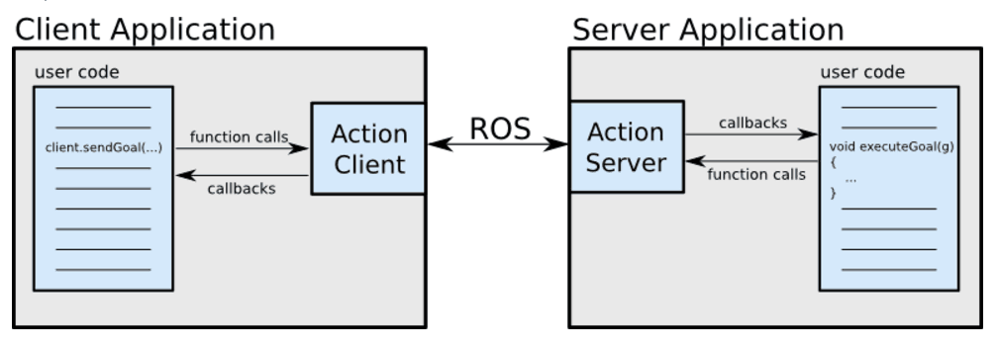

# Action

actionlib是ROS中一个很重要的库，类似service通信机制，actionlib也是一种请求响应机制的通信方式，actionlib主要弥补了service通信的一个不足，就是当机器人执行一个长时间的任务时，假如利用service通信方式，那么publisher会很长时间接受不到反馈的reply，致使通信受阻。当service通信不能很好的完成任务时候，actionlib则可以比较适合实现长时间的通信过程，actionlib通信过程可以随时被查看过程进度，也可以终止请求，这样的一个特性，使得它在一些特别的机制中拥有很高的效率。

## 1. Action通信原理

Action的工作原理是client-server模式，也是一个双向的通信模式。通信双方在ROS Action Protocol下通过消息进行数据的交流通信。client和server为用户提供一个简单的API来请求目标（在客户端）或通过函数调用和回调来执行目标（在服务器端）。



相当于Action是对机器人之间的通信进行了一层封装，对于用户程序而言，相当于是直接通信，但是实际上是用户程序和`Action Client`和`Action Server`通信

## 2. Action通信规范


通信过程中涉及到的消息类型

- `goal`
    - 由`Action Client`向`Action Server`发送用于设定动作需要用到的相关参数，比如运动目标点的坐标，速度等参数的设定
- `cancel`
    - Action执行的过程中，可以随时由`Action Client`向`Action Server`发送取消命令来终止动作任务
- `status`
    - 由`Action Server`向`Action Client`发送服务端当前的状态
- `restult`
    - 由`Action Server`向`Action Client`发送整个Action的执行结果，这个结果只会发送一次
- `feedback`
    - 由`Action Server`向`Action Client`在Action执行过程中的数据，比如执行进度、机器人运动过程中的坐标，可周期性发送

## 3. action

`*.action`文件和`*.srv`文件类似，由`---`对各个部分进行分隔，`*.action`文件由三部分组成，分别是`goal`，`result`和`feedback`

### 3.1. action示例

以一个洗碗机的洗碗任务为例说明，`goal`部分是洗碗机的ID，在请求洗碗任务的时候需要指定洗碗机ID，`result`部分是最终洗碗的碗的数量，`feedback`部分是洗碗的进度，百分比表示，能在动作任务执行过程中随时汇报任务进度

```text
# Define the goal
uint32 dishwasher_id  # Specify which dishwasher we want to use
---
# Define the result
uint32 total_dishes_cleaned
---
# Define a feedback message
float32 percent_complete
```
