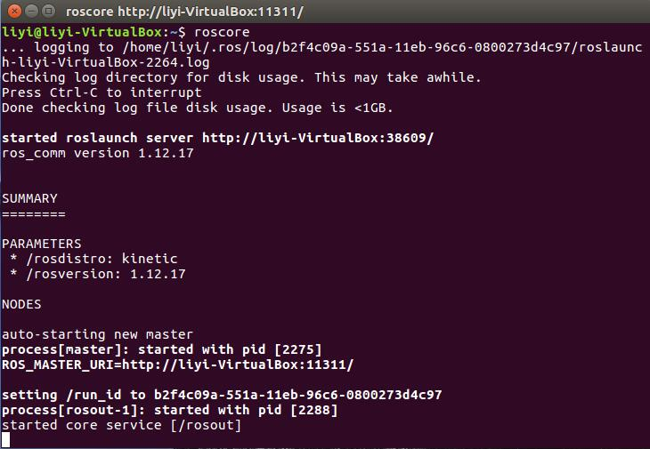
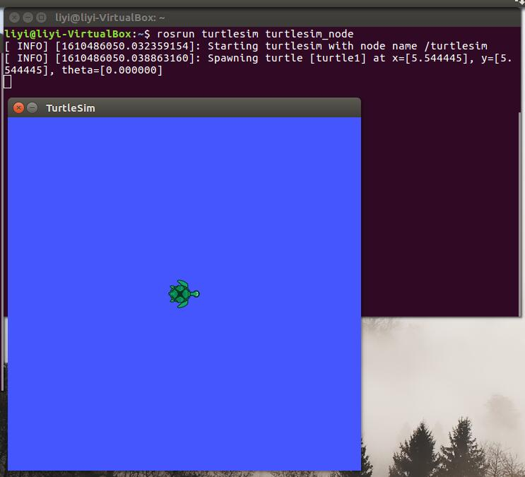
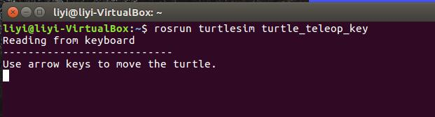

# ROS开发环境

## 1. 版本选择

| ROS版本 | Ubuntu 版本 |
| :---: | :---: |
| [ROS Kinetic Kame](http://wiki.ros.org/kinetic/Installation) | Ubuntu 16.04 |
| [ROS Melodic Morenia](http://wiki.ros.org/melodic/Installation) | Ubuntu 18.04 |
| [ROS Noetic Ninjemys](http://wiki.ros.org/noetic/Installation) | Ubuntu 20.04 |

ros的各个版本之间不相互兼容，安装前需要注意版本对应

## 2. 添加软件源

使用[中科大的镜像源](http://mirrors.ustc.edu.cn/help/ros.html)安装ROS

```Bash
sudo sh -c '. /etc/lsb-release && echo "deb http://mirrors.ustc.edu.cn/ros/ubuntu/ $DISTRIB_CODENAME main" > /etc/apt/sources.list.d/ros-latest.list'
```

## 3. 添加keys

```Bash
sudo apt-key adv --keyserver hkp://ha.pool.sks-keyservers.net:80 --recv-key 421C365BD9FF1F717815A3895523BAEEB01FA116
```

apt-key用于管理Debian Linux系统中的软件包密钥。每个发布的deb包，都是通过密钥认证的，apt-key用来管理密钥。

## 4. 更新软件源

```Bash
sudo apt-get update
sudo apt-get upgrade
```

update是更新软件列表，upgrade是更新已安装的软件

- 参考[apt-get update与upgrade的区别](https://www.jianshu.com/p/42a1850bdcf6)

## 5. 安装ROS

ros官方提供四种安装方式，Ubuntu16.04安装Kinetic版本

- 桌面完整版安装

  包括ROS、rqt、rviz、通用机器人函数库、2D/3D仿真器、导航以及2D/3D感知功能

  ```Bash
  sudo apt-get install ros-kinetic-desktop-full
  ```

- 桌面版安装

  包含ROS、rqt、rviz以及通用机器人函数库

  ```Bash
  sudo apt-get install ros-kinetic-desktop
  ```

- 基础版安装

  包含ROS核心软件包、构建工具以及通信相关的程序库，无GUI工具

  ```Bash
  sudo apt-get install ros-kinetic-ros-base
  ```

- 单独软件包安装

  可以用来安装指定软件包，这种安装方式在运行ROS缺少某些package依赖时会经常用到。

  ```bash
  sudo apt-get install ros-kinetic-PACKAGE
  ```

  用包名替代上述命令中的`PACKAGE`可安装相应的功能包

## 6. 配置ROS

### 6.1. 初始化rosdep

```bash
sudo rosdep init
sudo rosdep update
```

这里可能会因为github站点网络链接问题而报错，使用代理即可解决

### 6.2. ROS环境变量设置

```bash
echo "source /opt/ros/kinetic/setup.bash" >> ~/.bashrc
```

相当于每次打开终端都执行遍`source`命令

### 6.3. 安装rosinstall

```bash
sudo apt-get install python-rosinstall
```

## 7. 测试ROS环境

### 7.1. 启动`roscore`

```bash
roscore
```

成功启动后如下图所示



### 7.2. 启动海龟测试节点

```bash
rosrun turtlesim turtlesim_node
```

`turtlesim_node`节点是模拟海龟运动的节点



### 7.3. 启动控制节点

```bash
rosrun turtlesim  turtle_teleop_key
```

`turtle_teleop_key`节点是键盘控制节点


