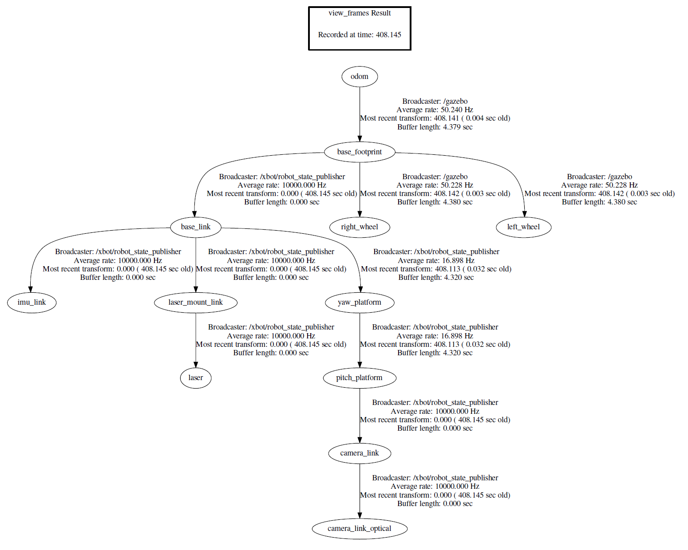
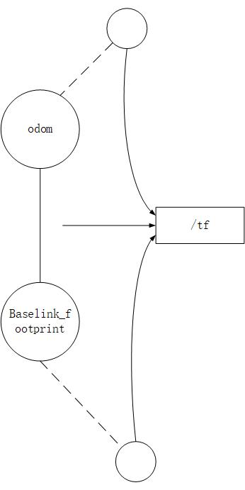

# TF 坐标转换

## 1. TF

TF即TransForm，坐标转换，对于机器人实际应用而言，本身会涉及到多个坐标系，而机器人的实际运动需要的数据要在同一个坐标系中才能准确完成，这就涉及到了坐标转化。

比如对于一个机械手的应用场景而言，通过摄像头采集画面，判断被抓物体的位置，然后再通过机械手的运动将物体从一点移动到另一点。在这个场景中就涉及到了多个坐标系

- 摄像头采集到的画面中被抓物体的坐标是在这摄像头的坐标系中，这个是相对于这一帧图像的坐标
- 机械手的相对运动需要用到的坐标是在机械手的坐标系中，这个是相对于机械手的原始位置的坐标
- 对于摄像头、机械手、被抓物体而言，在真实世界中又有一个真实世界中的坐标，这个是相对于真实世界的坐标

对于被抓物体而言，在一个时刻，对于这个几个坐标系有完全不同的坐标，相当于一个物体有多个坐标。因此要能够顺利完成机器人的动作，就需要在使用坐标数据之前对这些坐标在不同的坐标系之间完成转换。

## 2. ROS中的TF

坐标变换包括了位置和姿态两个方面的变换，ROS中的tf是一个可以让用户随时记录多个坐标系的软件包。tf保持缓存的树形结构中的坐标系之间的关系，并且允许用户在任何期望的时间点在任何两个坐标系之间转换点，矢量等。

tf的定义可以看作是一种标准规范，它定义了坐标转换的数据格式和数据结构。tf的数据结构本质是树形的，因此称之为`tf tree`

- tf可以被看作是一个`topic`：`/tf`，该话题中的`message`保存的就是`tf tree`的数据结构，这个数据结构维护着整个ros系统的坐标转换关系。
- tf也可以被看作是一个`package`，它也集成了一些工具，比如可视化、查看关节间的tf，`debug tf`等。tf的一些接口，就是roscpp和rospy里的API

ROS中关于机器人的描述分为link（部件）和joint（关节），机器人的每个每个link都对应这个一个frame，即坐标系。下图为一个机器人的TF结构的抽象示意图


link和frame的概念是绑定的，一个机器人各个frame之间的关系就是由`tf tree`来维护的。

可以通过执行`view_frames`命令来生成`frames.pdf`来显示`tf tree`结构，如下图所示



每个圆圈代表一个frame，对应着机器人的一个link，任意两个frame之间都必须是联通的，如果出现某一环节的断裂，就会引发error系统报错．所以完整的`tf tree`不能有任何断层的地方。两个frame之间都有`broadcaster`，这里的`broadcaster`就是ROS中`Topic`通信中的`publisher`，当两个frame之间有相对运动了，它通过发布消息来沟通两个frame，完成信息交换、坐标转换

- 参考[ROS中观察TF的工具](https://blog.csdn.net/wilylcyu/article/details/51724966)

## 3. TF消息

`TransformStampde.msg`定义的消息就是`broadcaster`维持两个frame之间关系的数据结构。

TransformStamped.msg格式规范

```yaml
std_mags/Header header
        uint32 seq
        time stamp
        string frame_id
string child_frame_id
geometry_msgs/Transform transform
        geometry_msgs/Vector3 translation
                float64 x
                float64 y
                float64 z
        geometry_msgs/Quaternion rotation
                float64 x
                float64 y
                flaot64 z
                float64 w
```

- `header`中定义了序号、时间戳、frame名字
- `child_frame_id`定义的是子坐标系，即当前坐标系要与那个坐标系进行坐标转换
- `geometry_msgs/Transform`定义的就是这两个frame之间作什么样的坐标变换，`Vector3`定义平移，`Quaternion`定义三维旋转



对于上图所示的坐标转换关系而言

- `header`中`frame_id`为`odom`
- `child_frame_id`为`Baselink_footprint`
- `transform`的具体值即`odom`和`Baselink_footprint`坐标系之间的转换关系
