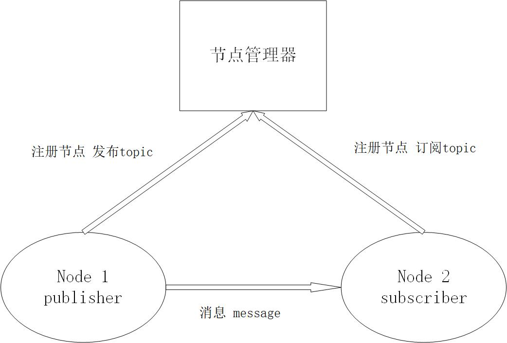

# Topic和msg

## 1. Topic

ROS的Topic通信通常用于实时性、周期性的消息通信，Topic是一个点对点的通信模型，这里的点指的是节点（Node），通信模型是 **发布-订阅** 模型，要建立通信需要经过几个步骤

1. 发布者（Publisher）和订阅者（Subscriber）节点向`Master`注册
2. 发布者发布一个话题
3. `Master`指挥订阅者进行订阅相应的话题
4. 建立起发布者到订阅者的单向点对点通信

一个Topic可以被多个订阅者订阅，多个发布者也可以向同一个Topic发布消息，订阅者和发布者之间的通信是直接进行的，不经过Master转发，只是订阅者从Master处获取订阅的话题信息，建立通信

Topic通信是异步通信，发布者发布消息之后继续执行相应的工作，不等待任何人反馈，订阅者在收到发布者发布的消息之后，调用回调函数进行消息处理。

参考[ROS多个传感器publish同一个Topic](https://my.oschina.net/u/4353930/blog/4287439)



### 1.1. rostopic命令

| 命令 | 作用 |
| :------: | :------: |
| `rostopic help` | 帮助，查询相关命令具体用法 |
| `rostopic list` | 列出当前所有的topic |
| `rostopic info topic_name` |  显示某个topic的属性信息 |
| `rostopic echo topic_name` |  显示某个topic的内容 |
| `rostopic pub topic_name ...` |  向某个topic发布内容 |
| `rostopic bw topic_name` |  查看某个topic的带宽 |
| `rostopic hz topic_name` |  查看某个topic的频率 |
| `rostopic find topic_type` |  查找某个类型的topic |
| `rostopic type topic_name` |  查看某个topic的类型(msg) |

### 1.2. 通信示例

机载平台采集并处理摄像头信息，笔记本电脑上对摄像头的数据进行显示，这里有三个节点


- `Node1摄像头节点`
    - 控制摄像头采集数据，运行在机载平台
- `Node2图像处理节点`
    - 对摄像头采集的数据进行处理，保障机器人的后续功能，运行在机载平台
- `Node3图像显示节点`
    - 对摄像头采集的数据在笔记本电脑上进行显示，运行在远程笔记本平台上

三个节点加入ROS通信网络，向`Master`节点进行注册，`Node1摄像头节点`启动之后作为发布者开始向`/camera_rgb`话题发布数据，`Node2图像处理节点`和`Node3图像显示节点`启动后作为订阅者，经过`Master`节点管理器的控制，分别和`Node1摄像头节点`建立通信

`Node1摄像头节点`只管发布数据，不关心`Node2图像处理节点`和`Node3图像显示节点`是否收到消息、是否处理完消息，同样`Node2图像处理节点`和`Node3图像显示节点`只在接收到`Node1摄像头节点`发布的消息之后对消息进行相应的处理，不关心`Node1摄像头节点`在什么时候发布消息，处理完消息之后不需要向`Node1摄像头节点`发送任何反馈，这体现了Topic通信的异步性质

## 2. Message

Topic通信过程中的数据发布与订阅处理等有严格的格式要求，需要预先约定消息的格式，通过Message来确定数据格式，例如上述示例中的`/camera_rgb`话题，这个话题的消息格式只能是ROS中定义好的RGB图像格式，这种数据格式就是Message。Message定义在`msg/`下的`*.msg`文件中

### 2.1. rosmsg命令

| rosmsg命令 | 作用 |
| :------: | :------: |
| `rosmsg list` | 列出系统上所有的msg |
| `rosmsg show msg_name` | 显示某个msg的内容 |

### 2.2. 结构与类型

Message有几种基本的数据类型

- `bool`
- `int8`
- `int16`
- `int32`
- `int64`
- `uint`
- `float`
- `float64`
- `string`
- `time`
- `duration`
- `header`
- `array[]`
    - 可变长数组
- `array[C]`
    - 固定长度数组

每个`*.msg`文件的文件名又形成了一个新的数据结构，可以在其他的`*.msg`文件中直接使用，类似与C语言中的struct结构体

### 2.3. msg文件示例

ROS定义的`Header.msg`

```text
# 定义数据的参考时间和参考坐标
# 文件位置:std_msgs/Header.msg

uint32 seq          #数据ID
time stamp          #数据时间戳
string frame_id     #数据的参考坐标系
```

用户自定义的`Vector3.msg`

```text
# 三维度向量
# 位置:geometry_msgs/Vector3.msg

float64 x
float64 y
float64 z
```

用户自定义的`Quaternion.msg`

```text
# 消息代表空间中旋转的四元数
# 位置:geometry_msgs/Quaternion.msg

float64 x
float64 y
float64 z
float64 w
```

用户自定义的`Imu.msg`

```text
# 消息包含了从惯性原件中得到的数据，加速度为m/^2，角速度为rad/s
# 如果所有的测量协方差已知，则需要全部填充进来
# 如果只知道方差，则只填充协方差矩阵的对角数据即可

# 位置：sensor_msgs/Imu.msg

Header header
Quaternion orientation
float64[9] orientation_covariance

Vector3 angular_velocity
float64[9] angular_velocity_covariance

Vector3 linear_acceleration
float64[] linear_acceleration_covariance
```
