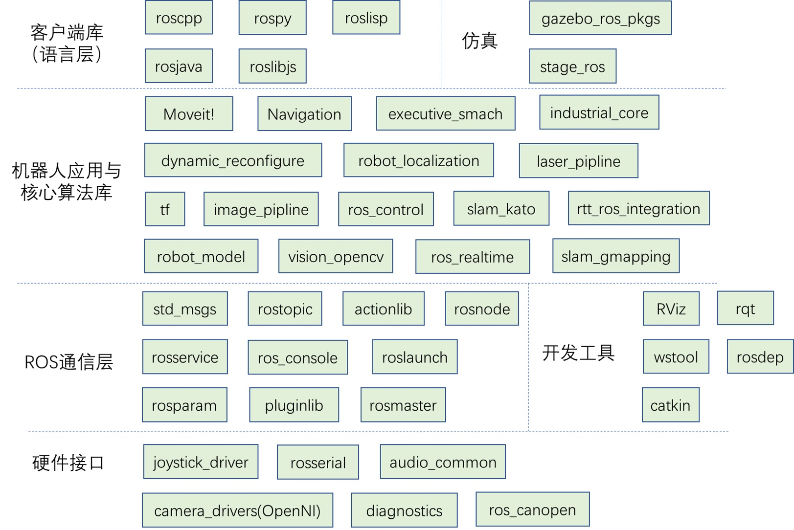

# roscpp

## 1. Client Library简介

ROS为机器人开发者们提供了不同语言的编程接口，比如C++接口叫做roscpp，Python接口叫做rospy，Java接口叫做rosjava。这些接口都可以用来创建topic、service、param，实现ROS的通信功能。Clinet Lirary有点类似开发中的Helper Class，把一些常用的基本功能做了封装。

从开发客户端库的角度看，一个客户端库，至少需要能够包括master注册、名称管理、消息收发等功能。这样才能给开发者提供对ROS通信架构进行配置的方法。



## 2. roscpp简介

roscpp相当于一个C++库，这个库包括了ROS节点的各种功能实现，roscpp位于`/opt/ros/kinetic`之下，用C++实现了ROS通信。在ROS中，C++的代码是通过`catkin`这个编译系统（扩展的CMake）来进行编译构建的。我们创建一个CMake工程，在其中include了roscpp等ROS的libraries，这样就可以在工程中使用ROS提供的函数了。

这个文件里包含了所有roscpp相关的头文件

```cpp
#include <ros/ros.h>
```

roscpp包含的几个部分如下

- `ros::init_options`命名空间包含节点初始化等功能性的函数
    - 包含`ros::init()`初始化函数，有三个重载，在使用ROS系统相关功能之前必须调用这个函数
- `ros::NodeHandle`类，句柄主要用来实现和topic、service、param等交互的公共接口
- `ros::master`命名空间包含从master查询信息的函数
- `ros::this_node`命名空间包含查询这个node的函数
- `ros::service`命名空间包含查询服务的函数
- `ros::param`命名空间包含查询参数服务器的函数，而不需要用到NodeHandle
- `ros::names`命名空间包含处理ROS图资源名称的函数

关于命名空间的详细解释参考[官方wiki](http://docs.ros.org/api/roscpp/html/index.html)
