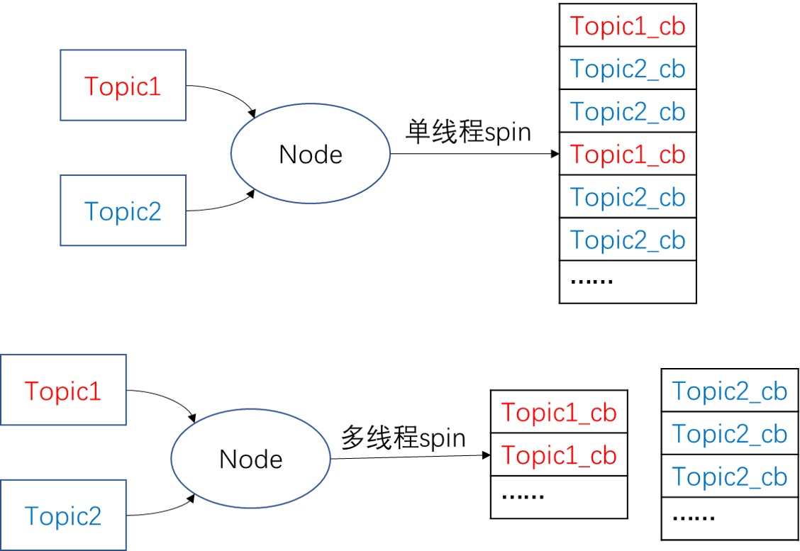

# topic in roscpp

[topic和msg相关解释](./Topic和msg.md)

以`topic_demo`为例，自定义一个`gps`类型的消息（包括`x`, `y`, `state`），一个节点以一定频率模拟发布`gps`信息，另一个节点进行消息接收并计算出当前位置与原点`(0, 0)`的欧氏距离

## 1. 创建消息

新建`topic_demo/msg/gps.msg`文件

```text
float32 x       # x坐标
float32 y       # y坐标
string state    # 工作状态
```

- 程序中对消息的操作方法类似于对结构体的操作。

## 2. 创建节点

### 2.1. 消息发布节点

`topic_demo/src/talker.cpp`文件

```cpp
#include <ros/ros.h>
#include <topic_demo/gps.h>

int main(int argc, char **argv)
{
    //用于解析ROS参数，第三个参数为本节点名
    ros::init(argc, argv, "talker");

    //实例化句柄，初始化node
    ros::NodeHandle nh;

    //自定义gps msg
    topic_demo::gps msg;
    msg.x = 1.0;
    msg.y = 1.0;
    msg.state = "working";

    //创建publisher
    ros::Publisher pub = nh.advertise<topic_demo::gps>("gps_info", 1);

    //定义发布的频率 
    ros::Rate loop_rate(1.0);
    //循环发布msg
    while (ros::ok())
    {
        //以指数增长，每隔1秒更新一次
        msg.x *= 1.03;
        msg.y *= 1.01;
        ROS_INFO("Talker: GPS: x = %f, y = %f ",  msg.x ,msg.y);
        //以1Hz的频率发布msg
        pub.publish(msg);
        //根据前面定义的频率, sleep 1s
        loop_rate.sleep();//根据前面的定义的loop_rate,设置1s的暂停
    }

    return 0;
} 
```

- 节点句柄的`advertise`函数是模板函数，因此在创建`ros::Publisher`对象时需要指定消息类型为`topic_demo::gps`，指定`pub`的发布主题为`gps_info`，发送队列大小为1
- `topic_demo::gps`这个消息的命名空间为`topic_demo`的原因是`CMakeLists.txt`中定义的项目名是`topic_demo`

### 2.2. 消息接收节点

#### 2.2.1. `topic_demo/src/listener.cpp`文件

```cpp
#include <ros/ros.h>
#include <topic_demo/gps.h>
#include <std_msgs/Float32.h>

void gpsCallback(const topic_demo::gps::ConstPtr &msg)
{  
    //计算离原点(0,0)的距离
    std_msgs::Float32 distance;
    distance.data = sqrt(pow(msg->x,2)+pow(msg->y,2));
    //float distance = sqrt(pow(msg->x,2)+pow(msg->y,2));
    ROS_INFO("Listener: Distance to origin = %f, state: %s",distance.data,msg->state.c_str());
}

int main(int argc, char **argv)
{
    ros::init(argc, argv, "listener");
    ros::NodeHandle n;
    ros::Subscriber sub = n.subscribe("gps_info", 1, gpsCallback);
    //ros::spin()用于调用所有可触发的回调函数。将进入循环，不会返回，类似于在循环里反复调用ros::spinOnce()。
    ros::spin(); 
    return 0;
}
```

- 在新建`ros::Subscriber`对象的时候需要指定主题名、接收队列大小、回调函数的函数指针，这里的`gpsCallback`函数是回调函数的函数指针，只有`sub`收到消息的时候才会调用该函数。
- 具体去触发回调函数的命令就是`ros::spin()`，它会反复的查看有没有消息来，如果有就会让回调函数去处理。若只指定了`callback`函数，而不进行`ros::spin()`或者`ros::spinOnce()`最终也回调函数不会生效

#### 2.2.2. 消息队列处理

`Subscriber`接收到消息，实际上是先把消息放到一个队列中去。队列的长度在`Subscriber`构建的时候设置好了。当有`spin`函数执行，就会去处理消息队列中队首的消息。

| spin方法| 阻塞/非阻塞 | 单线程/多线程 |
| :---: | :---: | :---: |
| `ros::spin()` | 阻塞 | 单线程 |
| `ros::spinOnce()` | 非阻塞 | 单线程 |
| `ros::MultiThreadedSpin()` | 阻塞 | 多线程 |
| `ros::AsyncMultiThreadedSpin()` | 非阻塞 | 多线程 |

阻塞类的spin函数执行的时候相当于程序进入了一个死循环，一直检查是否有新的消息入队，消息的处理通过回调函数来执行，因此正常情况下在阻塞类的spin函数之后的代码不会执行。

单线程与多线程的消息处理示意图如下



## 3. 项目结构文件

### 3.1. `topic_demo/CMakeLists.txt`文件

```cmake
cmake_minimum_required(VERSION 2.8.3)
project(topic_demo)

find_package(catkin REQUIRED COMPONENTS
    roscpp
    std_msgs
    message_generation
)

add_message_files(FILES
    gps.msg
)

generate_messages(DEPENDENCIES
    std_msgs
)

add_executable(talker src/talker.cpp) #生成可执行文件talker

# add_dependencies(talker topic_demo_generate_messages_cpp)
add_dependencies(talker ${${PROJECT_NAME}_EXPORTED_TARGETS} ${catkin_EXPORTED_TARGETS})
# 表明在编译talker前，必须先生编译完成自定义消息
# 必须添加add_dependencies，否则找不到自定义的msg产生的头文件
# 表明在编译talker前，必须先生编译完成自定义消息

target_link_libraries(talker ${catkin_LIBRARIES}) #链接

add_executable(listener src/listener.cpp ) #声称可执行文件listener
add_dependencies(listener ${${PROJECT_NAME}_EXPORTED_TARGETS} ${catkin_EXPORTED_TARGETS})
target_link_libraries(listener ${catkin_LIBRARIES})#链接
```

- ROS的消息的格式即`msg`文件是ROS自行定义的，并不是Cpp的标准，因此需要依赖`message_generation`功能包来将`gps.msg`文件“编译”成符合Cpp标准的形式的结构体、头文件等
- 消息中用到的`float32`和`string`并不是Cpp的标准格式，而是ROS系统提供的格式，因此需要依赖`std_msgs`包
- `generate_messages()`是用来生成msg的，如果没有这行，在源程序中会找不到`gps.h`，也就是没有生成消息结构体

参考[ROS 机器人技术 - 解析 CMakeList.txt 文件](https://dlonng.com/posts/ros-cmakelist)

### 3.2. `topic_demo/package.xml`文件

```xml
<package format = "2">
  <name> topic_demo </name>
  <version> 0.1.0 </version>
  <description>
      This package topic_demo
  </description>

  <maintainer email="user@example.com">someone</maintainer>
  <license> mit </license>

  <buildtool_depend> catkin </buildtool_depend>

  <depend> roscpp </depend>
  <depend> std_msgs </depend>

  <build_depend> message_generation </build_depend>

  <exec_depend> message_runtime </exec_depend>

</package>
```

- 在编译的时候需要用到`message_generation`依赖
- 在节点运行的时候需要用到`message_runtime`依赖，提供消息运行时需要的依赖
- xml文件的必填项参考[package.xml](./package.xml.md)
